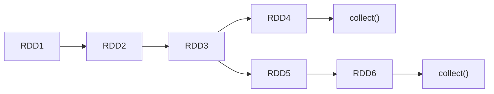

# Spark Core

## Spark vs Hadoop

==Spark 是一种基于内存的快速、通用、可扩展的分布式分析计算引擎。==

Hadoop 属于**一次性数据计算**框架：框架在处理数据的时候，会从存储介质中读取数据，进行逻辑操作，然后将处理的结果重新存储回介质中。通过磁盘 IO 进行作业会消耗大量资源和时间，效率很低。

Spark 框架是**基于内存**计算的，它将大量的输入数据和中间数据都缓存到内存中，能够有效地提高交互型 Job 和迭代型 Job 的执行效率。

==Spark 和 Hadoop 的根本差异是多个作业之间的数据通信问题== : Spark 多个作业之间数据通信是基于内存，而 Hadoop 是基于磁盘。

在绝大多数的数据计算场景中，Spark 确实会比 MapReduce 更有优势。但是 Spark 是基于内存的，所以在实际的生产环境中，由于**内存的限制**，可能会由于内存资源不够导致 Job 执行失败，此时，MapReduce 其实是一个更好的选择，所以 Spark 并不能完全替代 MR。

## Spark 核心模块


## Spark 运行架构

Spark 框架的核心是一个计算引擎，整体来说，它采用了标准 master-slave 的结构。

如下图所示，它展示了一个 Spark 执行时的基本结构。图形中的 Driver 表示 master， 负责管理整个集群中的作业任务调度。图形中的 Executor 则是 slave，负责实际执行任务。


由上图可以看出，对于 Spark 框架有两个核心组件：

- Driver
- Executor

Driver：

Spark Driver，指实际运行在 Spark 应用中 main() 函数的进程。Driver 独立于 Master 进程，如果是 Yarn 集群，那么 Driver 也可能被调度到 Worker 节点上运行。

Driver 在 Spark 作业执行时主要负责：

- 将用户程序转化为作业 (job)
- 在 Executor 之间调度任务 (task)
- 跟踪 Executor 的执行情况

Executor：

Spark Executor 在物理上是 Worker 节点中的一个 **JVM 进程**，负责在 Spark 作业中运行具体任务 (Task)，任务彼此之间相互独立。Spark 应用启动时，Executor 节点被同时启动，并且始终伴随着整个 Spark 应用的生命周期而存在。如果有 Executor 节点发生了故障或崩溃，Spark 应用也可以继续执行，会将出错节点上的任务调度到其他 Executor 节点上继续运行。

Executor 有两个核心功能:

- 负责运行组成 Spark 应用的任务，并将结果返回给 Driver 进程
- 它们通过自身的块管理器 (Block Manager) 为用户程序中要求缓存的 RDD 提供内存式存储。RDD 是直接缓存在 Executor 进程内的，因此任务可以在运行时充分利用缓存数据加速运算。

---

## WordCount

注意使用 Maven 创建项目，add framework support for Scala，然后在 Maven 中添加 Spark 依赖，注意必须使用 JDK1.8。

```scala
hello world
hello spark
hi java

hello java
hello spark
hi spark

package com.anson

import org.apache.spark.rdd.RDD
import org.apache.spark.{SparkConf, SparkContext}

object Spark01_WordCount {
  def main(args: Array[String]): Unit = {
    // 建立和Spark框架的连接
    val sparkConf = new SparkConf().setMaster("local").setAppName("WordCount")
    val sc = new SparkContext(sparkConf)

    // 执行业务操作
    // 读取文件，获取一行行的数据
    val lines: RDD[String] = sc.textFile("data")

    // 将一行行的数据进行分词，扁平化 hello, world, hello, spark
    val words: RDD[String] = lines.flatMap(_.split(" "))

    // 分组 (hello, hello, hello), (world, world)
    val wordGroup: RDD[(String, Iterable[String])] = words.groupBy(word => word)

    // 对分组后的数据转换
    val wordToCount = wordGroup.map {
      case (word, list) => {
        (word, list.size)
      }
    }

    // 将结果打印到控制台
    val array: Array[(String, Int)] = wordToCount.collect()
    array.foreach(println)

    // 关闭连接
    sc.stop()
  }
}

```

---

## Spark 的三个开发入门类

- SparkConf

SparkConf 是 Spark 的配置类，作用是将默认配置文件中的 kv 对加载到内存之中。另外我们看到该类中有一个核心的数据结构：ConcurrentHashMap，因此是一个线程线程安全的 kv 结构。该类中有大量的 set 和 get 方法。

注意：一旦 SparkConf 对象被传递给 Spark，它就会被克隆，并且用户不能再修改它。Spark 不支持在运行时修改配置。

- SparkContext

SparkContext 是 Spark 中的主要入口点，它是与 Spark 集群通信的核心对象。SparkContext 的核心作用是**初始化 Spark 应用程序运行所需要的核心组件**，包括高层调度器(DAGScheduler)、底层调度器(TaskScheduler)和调度器的通信终端(SchedulerBackend)，同时还会负责 Spark 程序向 Master 注册程序等。

- SparkSession

SparkSession 也是 Spark 中的主要入口点。SparkSession 主要用在 SparkSQL 中，当然也可以用在其他场合，他可以代替 SparkContext。SparkSession 实际上封装了 SparkContext。

---

## RDD 简介

RDD(Resilient Distributed Dataset) 叫做**弹性分布式数据集**，是 Spark 中最基本的数据处理模型。代码中是一个抽象类，它代表一个弹性的、不可变、可分区、里面的元素可并行计算的集合。

> A Resilient Distributed Dataset (RDD), the basic abstraction in Spark. Represents an immutable, partitioned collection of elements that can be operated on in parallel.

弹性：

- 存储的弹性：内存与磁盘的自动切换
- 容错的弹性：基于血缘的高效容错
- 计算的弹性：Task 失败后的自动重试
- 分片的弹性：可根据需要重新分片

分布式：数据存储在大数据集群不同节点上

数据集：RDD 封装了计算逻辑，并不保存数据

数据抽象：RDD 是一个抽象类，需要子类具体实现

不可变：RDD 封装了计算逻辑，是不可以改变的。如果想要改变，只能产生新的 RDD，在新的 RDD 里面封装计算逻辑

可分区、并行计算


RDD 是 Spark 对于分布式数据集的抽象，每一个 RDD 都代表着一种**分布式数据形态**。比如 lineRDD，它表示数据在集群中以行（Line）的形式存在；而 wordRDD 则意味着数据的形态是单词，分布在计算集群中。

!!! question "RDD 和普通数据结构/容器的区别？"

    1. RDD只是一个逻辑概念，在内存中并不会真正地为某个 RDD 分配空间（除非需要被缓存）。RDD 中的数据只会在计算中产生，而且在计算完成后消失。
    2. RDD 可以包含多个数据分区，不同分区可以由不同的 task 在不同节点进行处理。

---

## RDD 的核心属性

Internally, each RDD is characterized by five main properties:

- A list of partitions
- A function for computing each split
- A list of dependencies on other RDDs
- Optionally, a Partitioner for key-value RDDs (e.g. to say that the RDD is hash-partitioned)
- Optionally, a list of preferred locations to compute each split on (e.g. block locations for an HDFS file)

---

- **分区列表**：每个分区为 RDD 的一部分数据，分区的数量决定了 RDD 的并行度。
- **分区计算函数**：Spark 在计算时，是使用分区函数对每一个分区进行计算。
- **RDD 之间的依赖关系**：RDD 是计算模型的封装，当需求中需要将多个计算模型进行组合时，就需要将多个 RDD 建立依赖关系。
- **分区器 (可选)** ：当数据为 KV 类型数据时，可以指定分区器（Hash/Range/自定义）。
- **首选位置 (可选)**：计算数据时，判断把计算发送到哪个节点效率最优：移动计算，而不是移动数据。

---

总结：

- RDD 可以看做是一系列的分区，每个分区就是一个数据集片段
- RDD 之间存在依赖关系
- 算子是作用在分区之上的
- 分区器是作用在 KV 类型的 RDD 上的
- 移动计算，而不是移动数据

---

## RDD 的执行原理

从计算的角度来讲，数据处理过程中需要计算资源 (内存 & CPU) 和计算模型 (逻辑)。执行时，需要将计算资源和计算模型进行协调和整合。

Spark 框架在执行时，先申请资源，然后将应用程序的数据处理逻辑分解成一个一个的计算任务，然后将任务发到已经分配资源的计算节点上，按照指定的计算模型进行数据计算，最后得到计算结果。


从以上流程可以看出 RDD 在整个流程中主要用于将逻辑进行封装，并生成 Task 发送给 Executor 节点执行计算。

---

## RDD 的创建

在 Spark 中创建 RDD 的创建方式：

- 从集合 (内存) 中创建 RDD
- 从本地文件创建 RDD
- 从 HDFS 读取文件创建 RDD

```scala
object RDD_Memory {
  def main(args: Array[String]): Unit = {
    // 准备环境
    // [*]指当前机器可用核心数，如8核，此时Spark会用8个线程模拟
    val sparkConf = new SparkConf().setMaster("local[*]").setAppName("RDD")
    val sc = new SparkContext(sparkConf)

    // 从内存中创建RDD，将内存中集合的数据作为处理的数据源
    val rdd = sc.parallelize(Array(1, 2, 3, 4, 5))
    // val rdd = sc.makeRDD(Array(1, 2, 3, 4, 5)) // 底层实现就是调用了RDD对象的parallelize()方法
    rdd.collect().foreach(println)

    // 关闭环境
    sc.stop()
  }
}
object RDD_File {
  def main(args: Array[String]): Unit = {
    // 准备环境
    val sparkConf = new SparkConf().setMaster("local[*]").setAppName("RDD")
    val sc = new SparkContext(sparkConf)

    // 从文件中的数据作为数据源
    // 路径默认以当前环境的根路径为基准，绝对、相对路径都行，也可以是目录名
    val rdd = sc.textFile("data/1.txt")
    rdd.collect().foreach(println)

    // 关闭环境
    sc.stop()
  }
}
```

---

## Job、Stage、Task

- 一个 Action 算子对应一个 Job
- Stage 按照宽依赖划分
- 一个分区对应一个 Task

理论上：每一个 Stage 下有多少个分区，就有多少个 Task，Task 的数量就是任务的最大并行度。一般情况下一个 Task 使用一个 core。

实际上：最大的并行度，取决于任务运行时使用的 Executor 拥有的最大核数。

> 如果 Task 的数量超过了核数，那么多出来的 Task 就需要等待之前的 Task 执行完毕后才能执行。

---

## 分区与并行度

默认情况下，Spark 可以将一个作业切分多个任务后，发送给 Executor 节点并行计算，而**能够并行计算的任务数量我们称之为并行度**。这个数量可以在构建 RDD 时指定。

分区数：是一个静态的概念，如果是内存数据，那么分区数和设置的并行度一致；如果是 HDFS 文件，那么分区数就是 HDFS 文件 Block 个数。

并行度：是一个动态的概念，取决于当前资源的可用核数。

并行度小于等于分区数。

```scala
object RDD_Par {
  def main(args: Array[String]): Unit = {
    // 准备环境
    val sparkConf = new SparkConf().setMaster("local[*]").setAppName("RDD")
    val sc = new SparkContext(sparkConf)

    // RDD的并行度和分区
    // makeRDD方法的第二个参数可以设置分区数，默认值为defaultParallelism（默认并行度）,
    // 是从上面的sparkConf中获取的，即当前环境的最大可用核数
    val rdd = sc.makeRDD(List(1, 2, 3, 4), 2)
    rdd.saveAsTextFile("output")

    // 关闭环境
    sc.stop()
  }
}
```

读取**内存数据**时，数据可以按照并行度的设定进行数据的分区操作，数据分区规则的 Spark 核心源码如下：

```scala
def positions(length: Long, numSlices: Int): Iterator[(Int, Int)] = {
  (0 until numSlices).iterator.map { i =>
    val start = ((i * length) / numSlices).toInt
    val end = (((i + 1) * length) / numSlices).toInt
    (start, end)
  }
}
object RDD_Par_File {
  def main(args: Array[String]): Unit = {
    // 准备环境
    val sparkConf = new SparkConf().setMaster("local[*]").setAppName("RDD")
    val sc = new SparkContext(sparkConf)

    // textFile可以将文件作为数据源，默认也可以设置分区（第二个参数）
    // minPartitions：最小分区数量
    // math.min(defaultParallelism, 2)
    val rdd = sc.textFile("data/1.txt", 2)
    rdd.saveAsTextFile("output")

    // 关闭环境
    sc.stop()
  }
}
```

读取**文件数据**时，分区个数默认 = HDFS 文件切片的个数。

假设文件有 7 个字节，`totalSize = 7` ，`goalSize = 7/2 = 3` ，`7/3 = 2 ... 1` ，也就是说 2 个分区够装 6 个字节，还有剩余 1 个字节，但是此时这一个字节 `1/3 = 33.3% > 10%` ，超过了 hadoop 的 1.1 倍原则，会多创建一个分区，因此最终会创建 3 个分区。

Spark 分区数据的分配：

- Spark 读取文件，采取的是 hadoop 的方式读取，即一行一行地读取，和字节数无关。
- 数据读取时以偏移量为单位。

---

## Spark 调度系统


从全局视角来看，DAGScheduler 是任务调度的发起者，DAGScheduler 以 TaskSet 为粒度，向 TaskScheduler 提交任务调度请求。TaskScheduler 在初始化的过程中，会创建任务调度队列，任务调度队列用于缓存 DAGScheduler 提交的 TaskSets。TaskScheduler 结合 SchedulerBackend 提供的 WorkerOffer，按照预先设置的调度策略依次对队列中的任务进行调度。

> 简而言之，DAGScheduler 手里有“活儿”，SchedulerBackend 手里有“人力”，TaskScheduler 的核心职能，就是把合适的“活儿”派发到合适的“人”的手里。

### DAGScheduler

DAGScheduler 的核心职责，是把计算图 DAG 拆分为执行阶段 Stages，Stages 指的是不同的运行阶段，同时还要负责把 Stages 转化为任务集合 TaskSets。

用一句话来概括从 DAG 到 Stages 的拆分过程，那就是：**以 Actions 算子为起点，从后向前回溯 DAG，以 Shuffle 操作为边界去划分 Stages**。

在 Stages 创建完毕之后，就到了触发计算的第二个步骤：**Spark 从后向前，以递归的方式，依次提请执行所有的 Stages**。


对于提请执行的每一个 Stage，DAGScheduler 根据 Stage 内 RDD 的 partitions 属性创建分布式任务集合 TaskSet。TaskSet 包含一个又一个分布式任务 Task，RDD 有多少数据分区，TaskSet 就包含多少个 Task。换句话说，**Task 与 RDD 的分区，是一一对应的**。

Task 对象的重要属性：


不难发现，taskBinary、partition 和 locs 这三个属性，一起描述了这样一件事情：Task 应该在哪里（locs）为谁（partition）执行什么任务（taskBinary）。

!!! note "DAGScheduler 的主要职责"

    - 根据用户代码构建 DAG；
    - 以 Shuffle 为边界切割 Stages；
    - 基于 Stages 创建 TaskSets，并将 TaskSets 提交给 TaskScheduler 请求调度。

---

### SchedulerBackend

对于集群中可用的计算资源，SchedulerBackend 用一个叫做 ExecutorDataMap 的数据结构，来记录每一个计算节点中 Executors 的资源状态。

这里的 ExecutorDataMap 是一种 HashMap，它的 Key 是标记 Executor 的字符串，Value 是一种叫做 ExecutorData 的数据结构。ExecutorData 用于封装 Executor 的资源状态，如 RPC 地址、主机地址、可用 CPU 核数和满配 CPU 核数等等，它相当于是对 Executor 做的“资源画像”。


此外，SchedulerBackend 以 WorkerOffer 为粒度提供计算资源。其中，WorkerOffer 封装了 Executor ID、主机地址和 CPU 核数，它用来表示一份可用于调度任务的空闲资源。

!!! question "SchedulerBackend 如何动态维护 ExecutorDataMap？"

    SchedulerBackend 与集群内所有 Executors 中的 ExecutorBackend 保持周期性通信，双方通过 LaunchedExecutor、RemoveExecutor、StatusUpdate 等消息来互通有无、变更可用计算资源。

---

### TaskScheduler

对于 SchedulerBackend 提供的一个个 WorkerOffer，TaskScheduler 是依据什么规则来挑选 Tasks 的呢？

对于给定的 WorkerOffer，TaskScheduler 是按照**任务的本地倾向性**，来遴选出 TaskSet 中适合调度的 Tasks。

??? note "任务的本地倾向性"

    Task 与 RDD 的 partitions 是一一对应的，在创建 Task 的过程中，DAGScheduler 会根据数据分区的物理地址，来为 Task 设置 locs 属性。locs 属性记录了数据分区所在的计算节点、甚至是 Executor 进程 ID。

    举例来说，当我们调用 textFile API 从 HDFS 文件系统中读取源文件时，Spark 会根据 HDFS NameNode 当中记录的元数据，获取数据分区的存储地址，例如 node0:/rootPath/partition0-replica0，node1:/rootPath/partition0-replica1 和 node2:/rootPath/partition0-replica2。

    那么，DAGScheduler 在为该数据分区创建 Task0 的时候，会把这些地址中的计算节点记录到 Task0 的 locs 属性。

    如此一来，当 TaskScheduler 需要调度 Task0 这个分布式任务的时候，根据 Task0 的 locs 属性，它就知道：“Task0 所需处理的数据分区，在节点 node0、node1、node2 上存有副本，因此，如果 WorkOffer 是来自这 3 个节点的计算资源，那对 Task0 来说就是投其所好”。


像上面这种定向到计算节点粒度的本地性倾向，Spark 中的术语叫做 NODE_LOCAL。除了定向到节点，Task 还可以定向到进程（Executor）、机架、任意地址，它们对应的术语分别是 PROCESS_LOCAL、RACK_LOCAL 和 ANY。

Spark 调度系统的核心思想，是**“数据不动、代码动”**。也就是说，在任务调度的过程中，为了完成分布式计算，Spark 倾向于让数据待在原地、保持不动，而把计算任务（代码）调度、分发到数据所在的地方，从而消除数据分发引入的性能隐患。毕竟，相比分发数据，分发代码要轻量得多。

---

### ExecutorBackend

每当 Task 处理完毕，这些线程便会通过 ExecutorBackend，向 Driver 端的 SchedulerBackend 发送 StatusUpdate 事件，告知 Task 执行状态。接下来，TaskScheduler 与 SchedulerBackend 通过接力的方式，最终把状态汇报给 DAGScheduler。


---

### 总结


任务调度分为如下 5 个步骤：

1. **DAGScheduler** 以 Shuffle 为边界，将开发者设计的计算图 **DAG 拆分为多个执行阶段 Stages**，然后为每个 Stage 创建任务集 TaskSet。
2. SchedulerBackend 通过与 Executors 中的 ExecutorBackend 的交互来实时地获取集群中可用的计算资源，并将这些信息记录到 ExecutorDataMap 数据结构。
3. 与此同时，**SchedulerBackend** 根据 ExecutorDataMap 中可用资源**创建 WorkerOffer**，以 WorkerOffer 为粒度提供计算资源。
4. 对于给定 WorkerOffer，**TaskScheduler** 结合 TaskSet 中任务的本地性倾向，按照 PROCESS_LOCAL、NODE_LOCAL、RACK_LOCAL 和 ANY 的顺序，依次**对 TaskSet 中的任务进行遍历**，优先调度本地性倾向要求苛刻的 Task。
5. 被选中的 Task 由 TaskScheduler 传递给 SchedulerBackend，再由 SchedulerBackend 分发到 Executors 中的 ExecutorBackend。Executors 接收到 Task 之后，即调用本地线程池来执行分布式任务。

---

## RDD 算子

[RDD Programming Guide - Transformations](https://spark.apache.org/docs/latest/rdd-programming-guide.html#transformations)

[RDD Programming Guide - Actions](https://spark.apache.org/docs/latest/rdd-programming-guide.html#actions)

算子：即 RDD 的方法。

- **分布式集合对象上的 API 称之为算子**。
- 本地对象的 API 称之为方法。

RDD 算子分为两大类：Transformation 和 Action。

- Transformation：转换算子，将原有 RDD 转换为新的 RDD，**懒加载，不会触发作业的执行**。
- Action：行动算子，触发作业的执行。


---

## RDD 序列化

闭包检测：

从计算的角度, 算子以外的代码都是在 Driver 端执行, 算子里面的代码都是在 Executor 端执行。那么在 scala 的函数式编程中，就会导致算子内经常会用到算子外的数据，这样就形成了闭包的效果，如果使用的算子外的数据无法序列化，就意味着无法传值给 Executor 端执行，就会发生错误，所以需要在执行任务计算前，检测闭包内的对象是否可以进行序列化，这个操作我们称之为**闭包检测**。

序列化方法和属性：

从计算的角度, 算子以外的代码都是在 Driver 端执行, 算子里面的代码都是在 Executor 端执行。

```scala
object RDD_Serialize {
  def main(args: Array[String]): Unit = {
    val sparkConf = new SparkConf().setMaster("local[*]").setAppName("Serialize")
    val sc = new SparkContext(sparkConf)

    val rdd = sc.makeRDD(List(1, 2, 3, 4))
    val user = new User()

    rdd.foreach(
      num => {
        println("age = " + (user.age + num))
      }
    )

    sc.stop()
  }

  class User {
    var age: Int = 30
  }
}
```

上面的代码会报 Task not serializable 异常，原因是 user 对象没有序列化。解决方法一是在 class User 后面混入 Serializable 特质。另一种方法是用样例类代替 class。样例类会在编译的时候自动完成序列化。

```scala
case class User() {
  var age: Int = 30
}
```

Kryo 序列化框架：

Java 的序列化能够序列化任何的类。但是比较重 (字节多)，序列化后，对象的提交也比较大。Spark 出于性能的考虑，Spark2.0 开始支持另外一种 Kryo 序列化机制。Kryo 速度是 Serializable 的 10 倍。当 RDD 在 Shuffle 数据的时候，简单数据类型、数组和字符串类型已经在 Spark 内部使用 Kryo 来序列化。

注意：即使使用 Kryo 序列化，也要继承 Serializable 接口。

---

## RDD 依赖关系

相邻的两个 RDD 的关系被称为**依赖关系**。多个连续的 RDD 的依赖关系被称为**血缘关系**。

每个 RDD 都会保存血缘关系。由于 RDD 是不会保存数据的（不落盘，通过内存传递），因此为了提供容错性，需要将 RDD 间的关系保存下来，一旦出现错误，可以根据血缘关系重新读取进行计算。

> RDD 只支持粗粒度转换，即在大量记录上执行的单个操作。将创建 RDD 的一系列 Lineage (血统) 记录下来，以便恢复丢失的分区。RDD 的 Lineage 会记录 RDD 的元数据信息和转换行为，当该 RDD 的部分分区数据丢失时，它可以根据这些信息来重新运算和恢复丢失的数据分区。

通过每次生成 RDD 之后调用 `rdd.toDebugString` 即可查看当前 RDD 的血缘关系。通过调用 `rdd.dependencies` 可以查看当前 RDD 的依赖关系。


如果父 RDD 中一个分区的数据只流向子 RDD 中的一个分区，这种依赖被称为**窄依赖（Narrow Dependency）**。

如果父 RDD 中一个分区的数据需要一部分流入子 RDD 的某一个分区，另外一部分流入子 RDD 的另外分区，这种依赖被称为**宽依赖（Shuffle Dependency）**。

!!! summary

    **如果 parent RDD 的一个或多个分区中的数据需要全部流入 child RDD 的某一个或多个分区，则是窄依赖。如果 parent RDD 分区中的数据需要一部分流入 child RDD 的某一个分区，另外一部分流入 child RDD 的另外分区，则是宽依赖。**


---

## RDD 阶段划分/物理执行计划生成

DAG 记录了 RDD 的转换过程和任务的阶段（stage）。


RDD 任务切分中间分为：Application、Job、Stage 和 Task。

- Application：初始化一个 SparkContext 即生成一个 Application
- Job：一个 Action 算子就会生成一个 Job
- Stage：Stage 等于宽依赖 (ShuffleDependency) 的个数加 1
- Task：一个 Stage 阶段中，最后一个 RDD 的分区个数就是 Task 的个数

所谓 Stage 划分算法就是：从最后一个 RDD 往前推算，遇到窄依赖就将其加入该 Stage，遇到宽依赖则断开，生成一个新的 Stage。**每个 Stage 里 Task 的数量由 Stage 中最后一个 RDD 的分区数量决定。**

!!! question "为什么需要划分阶段？"

    1. stage 中生成的 task 不会太大也不会太小，而且是同构的，便于**并行执行**
    2. 可以将多个操作放在一个 task 里处理，使得操作可以进行串行、流水线式的处理，**提高数据处理效率**
    3. **方便容错**，如一个 stage 失效，可以重新运行 stage 而不需要重新运行整个 job

物理计划生成过程：

1. 根据 action 算子将应用划分为多个 job
2. 根据宽依赖将 job 划分为多个 stage
3. 在每个 stage 中，根据最后一个 RDD 的分区个数将 stage 划分为多个 task

---

## RDD 持久化

RDD 的数据是过程数据，不是结果数据，新的 RDD 生成，老的 RDD 消失。所以在使用 RDD 时，可按需将 RDD 的数据持久化到内存或者磁盘中，以便后续使用。



如上图，RDD3 在第一次使用后，就从内存中释放了，第二次使用的时候，只能基于血缘关系，从 RDD1 开始重新计算。此时可以将 RDD3 持久化到内存中，这样第二次使用的时候，就可以直接从内存中获取。

### RDD 缓存/持久化

缓存机制的主要目的是加速计算。

- `rdd.cache()`：将 RDD 持久化到内存中
- `rdd.persist()`：将 RDD 持久化到内存或磁盘中
- `rdd.unpersist()`：将 RDD 从缓存中移除

缓存在设计上是认为有丢失风险的，因此，缓存会保留 RDD 之间的血缘关系。缓存如果丢失，则可以按照血缘关系重新计算。同时，缓存是分散存储在各个 Executor 上的。

缓存由 Executor 的 blockManager 管理，一旦 Driver 执行结束，blockManager 也会被释放，因此缓存的数据也会丢失。缓存 RDD 的分区存储在 blockManager 的 memoryStore 中，memoryStore 包含了一个 LinkedHashMap，用来存放 RDD 的分区。同时 Spark 也直接利用了 LinkedHashMap 的 LRU 功能实现了缓存替换。

cache() 是 lazy 执行的，只有遇到 Action 算子时才会执行。

Spark 从三个方面考虑了缓存级别：

- 存储位置：内存、磁盘、内存 + 磁盘
- 是否序列化：序列化减少了内存占用、方便网络传输，但是增加了反序列化的 CPU 的开销
- 存储副本数

```python
rdd.cache()
rdd.persist(StorageLevel.MEMORY_ONLY)
rdd.persist(StorageLevel.MEMORY_AND_DISK) # 先放内存，不够放磁盘
rdd.persist(StorageLevel.DISK_ONLY)
rdd.persist(StorageLevel.DISK_ONLY_2) # 2 代表副本数
rdd.persist(StorageLevel.DISK_ONLY_3)
```

---

### RDD Checkpoint

**Spark 的错误容忍机制的核心方法**：

1. 重新执行计算任务（根据 lineage 数据依赖关系，在错误发生时回溯需要重新计算的部分）
2. checkpoint 机制

所谓的检查点其实就是通过将 RDD 中间结果写入磁盘由于血缘依赖过长会造成**容错成本过高**，这样就不如在中间阶段做检查点容错，如果检查点之后有节点出现问题，可以从检查点开始重做血缘，减少了开销。

RDD Checkpoint 也是将 RDD 进行持久化，但是**只支持硬盘存储**。和缓存不同，Checkpoint 被认为是安全的，**会切断 RDD 的血缘关系**。

我们知道缓存是分散存储在各个 Executor 上的，Checkpoint 是**收集各个分区的数据，集中存储在一个地方**，这个地方可以是 HDFS、本地文件系统等。

checkpoint() 是等到 job 计算结束之后再重新启动该 job 计算一遍，对其中需要 checkpoint 的 RDD 进行持久化。也就是说，需要 checkpoint 的 RDD 会被计算两次。

在实际使用中，Checkpoint 一般和 Cache 配合使用，**先将数据 Cache 到内存中，然后再将数据 Checkpoint 到磁盘中**。这样执行 checkpoint 的 Job 只需要从内存中读取数据，而不需要重新计算，从而提高了效率。

!!! note "Cache VS Checkpoint"

      - **目的不同**：cache 的目的是加速计算，checkpoint 的目的更多是为了容错，在 job 运行失败后能够快速恢复
      - **存储性质和位置不同**：cache 是为了读写速度快，因此主要使用内存；而 checkpoint 是为了能够可靠读写，因此主要使用分布式文件系统
      - **写入速度和规则不同**：数据缓存速度较快，对 job 的执行时间影响较小；而 checkpoint 速度较慢，会额外启动专门的 job 进行持久化
      - **对 lineage 的影响不同**：cache 不会切断 RDD 的血缘关系，checkpoint 会切断 RDD 的血缘关系
      - **应用场景不同**：cache 适合会被多次读取、占用空间不是很大的 RDD；checkpoint 适用于数据依赖关系复杂、重新计算代价较高的 RDD

      - cache 是分散存储，各个 Executor 并行执行，效率高
      - checkpoint 是集中存储，需要将数据从各个 Executor 收集到 Driver
      - cache 的数据在 Driver 执行结束后会被删除，而 checkpoint 的数据持久化到了 HDFS 或本地磁盘，不会被删除，也能被其他 Driver program 使用

---

## RDD 分区器

Spark 中的分区方法：

1. **水平划分**：按照 record 的索引进行划分，常用于输入数据的划分，如 HDFS 自动对文件进行水平划分
2. **Hash 分区**：根据 record 的哈希值进行分区
3. **Range 分区**：一般用于排序任务，排序过程可以并行执行，并且可以保证全局有序

分区器决定了 RDD 中分区的个数、RDD 中每条数据经过 Shuffle 后进入哪个分区，进而决定了 Reduce 的个数。

- 只有 KV 类型的 RDD 才有分区器，非 KV 类型的 RDD 分区的值是 None
- 每个 RDD 的分区 ID 范围：0 ~ (numPartitions - 1)，决定这个值是属于那个分区的

Hash 分区：对于给定的 key，计算其 hashCode，并除以分区个数取余。可能导致数据倾斜。

Range 分区：**将一定范围内的数据映射到一个分区中，尽量保证每个分区数据均匀**，而且分区间有序。sortByKey 底层使用的数据分区器就是 RangePartitioner 分区器，因此 sortByKey 是可以保证全局有序的。如果数据分布不均匀，导致某个 key 数据量特别大，同样会造成数据倾斜，甚至会造成某个分区无数据。

```scala
sc.makeRDD(List(("a", 5), ("e", 4), ("e", 1), ("a", 1), ("b", 2), ("c", -3), ("d", 4)))
  .partitionBy(new HashPartitioner(2))
  .glom()
  .collect()
  .foreach(array => println(array.mkString(",")))
```

```scala
val rdd = sc.makeRDD(List(("a", 5), ("e", 4), ("e", 1), ("a", 1), ("b", 2), ("c", -3), ("d", 4)))
rdd.partitionBy(new RangePartitioner(2, rdd))
  .glom()
  .collect()
  .foreach(array => println(array.mkString(",")))
```

自定义分区器：

```scala
abstract class Partitioner extends Serializable {
  def numPartitions: Int
  def getPartition(key: Any): Int
}
```

```scala
import org.apache.spark.{Partitioner, SparkConf, SparkContext}

object Partitioner {
  def main(args: Array[String]): Unit = {
    val sparkConf = new SparkConf().setMaster("local[*]").setAppName("CustomPartitioner")
    val sc = new SparkContext(sparkConf)
    val rdd = sc.makeRDD(List(("a", 5), ("e", 4), ("f", 1), ("a", 1), ("b", 2), ("c", -3), ("d", 4)))
    rdd.partitionBy(new CustomPartitioner(3))
      .glom()
      .collect()
      .foreach(array => println(array.mkString(",")))
  }
}

class CustomPartitioner(num: Int) extends Partitioner {
  override def numPartitions: Int = num

  override def getPartition(key: Any): Int = {
    key match {
      case "a" => 0
      case "b" => 1
      case _ => 2
    }
  }
}
```


---

## Shuffle 机制

[Spark shuffle introduction | PPT (slideshare.net)](https://www.slideshare.net/colorant/spark-shuffle-introduction?from_action=save)

[Spark Shuffle Deep Dive (Explained In Depth) - How Shuffle Works in Spark | PPT (slideshare.net)](https://www.slideshare.net/bobyangbo/spark-shuffle-deep-dive-how-shuffle-works-in-spark?from_search=1)

Shuffle 在分布式计算场景中，它被引申为**集群范围内跨节点、跨进程的数据分发**。分布式数据集在集群内的分发，会引入大量的**磁盘 I/O** 与**网络 I/O**。

Shuffle 解决的问题是如何将数据重新组织，使其能够在上游和下游 task 之间进行传递和计算。

Shuffle 机制分为 Shuffle Write 和 Shuffle Read 两个阶段，前者主要解决上游 stage 数据分区的问题，后者主要解决下游 stage 从上游 stage 获取数据并聚合的问题。


如上图所示，以 Shuffle 为边界，reduceByKey 的计算被切割为两个执行阶段。约定俗成地，我们把 Shuffle 之前的 Stage 叫作 **Map 阶段**，而把 Shuffle 之后的 Stage 称作 **Reduce 阶段**。

> Map 阶段和 Reduce 阶段之间如何完成数据交换？
>
> 通过生产与消费 Shuffle 中间文件的方式，来完成集群范围内的数据交换。


在 Map 执行阶段，每个 Task 都会**生成包含 data 文件与 index 文件的 Shuffle 中间文件**，如上图所示。也就是说，Shuffle 文件的生成，**是以 Map Task 为粒度的**，Map 阶段有多少个 Map Task，就会生成多少份 Shuffle 中间文件。

---

### Shuffle Write

!!! question "如何确定分区个数？"

    1. 用户自定义
    2. 如果没有自定义，则默认分区个数是 parent RDD 中分区个数的最大值

!!! question "如何对 map 阶段的输出数据进行分区？"

    对 map 阶段输出的每一个 `<K, V>` record，根据 Key 计算其 partitionId，然后将其写入对应的分区文件中。


在生成中间文件的过程中，Spark 会借助一种类似于 Map 的数据结构，来计算、缓存并排序数据分区中的数据记录。这种 Map 结构的 Key 是（Reduce Task Partition ID，Record Key），而 Value 是原数据记录中的数据值。

当 Map 结构被填充满之后，Spark 根据主键对 Map 中的数据记录做排序，然后把所有内容溢出到磁盘中的临时文件。如此往复，直到数据分区中所有的数据记录都被处理完毕。

磁盘上存有若干个溢出的临时文件，而内存的 Map 结构中留有部分数据，Spark 使用归并排序算法对所有临时文件和 Map 结构剩余数据做合并，分别生成 data 文件、和与之对应的 index 文件。

总结：

1. 对于数据分区中的数据记录，逐一计算其目标分区，然后填充内存数据结构；
2. 当数据结构填满后，如果分区中还有未处理的数据记录，就对结构中的数据记录按（目标分区 ID，Key）排序，将所有数据溢出到临时文件，同时清空数据结构；
3. 重复前 2 个步骤，直到分区中所有的数据记录都被处理为止；
4. 对所有临时文件和内存数据结构中剩余的数据记录做归并排序，生成数据文件和索引文件。

---

### Shuffle Read

对于每一个 Map Task 生成的中间文件，其中的目标分区数量是由 Reduce 阶段的任务数量（又叫**并行度**）决定的。在下面的示意图中，Reduce 阶段的并行度是 3，因此，Map Task 的中间文件会包含 3 个目标分区的数据，而 **index 文件，恰恰是用来标记目标分区所属数据记录的起始索引**。


对于所有 Map Task 生成的中间文件，Reduce Task 需要通过网络从不同节点的硬盘中下载并拉取属于自己的数据内容。不同的 Reduce Task 正是根据 index 文件中的起始索引来确定哪些数据内容是“属于自己的”。

!!! question "如何实现数据聚合？"

    1. 通用的方式是**两阶段聚合**（two-phase aggregation），先将获取到的 `<K, V>` record 存放到 HashMap 中，然后对于 HashMap 中的每一个 `<K, list(V)>` record 进行聚合。
    2. 对于 reduceByKey(func) 等包含聚合函数的算子来说，可以采用**在线聚合**（online aggregation），即每个 record 加入 HashMap 中时，就同时进行 func() 聚合操作。


---

### 排序问题

有些操作如 sortByKey()、sortByKey() 需要对数据按照 Key 进行排序，这需要考虑两个问题：

1. 在哪里执行排序？
2. 先排序还是先聚合？

首先，在 Shuffle Read 端必须进行排序，因为从每个 task 获取的数据是无序的。其次，理论上，在 Shuffle Write 端不需要排序，但是如果进行了排序，那么 Shuffle Read 段就可以获得局部有序的数据，可以减少 Shuffle Read 端排序的开销。

对于先排序还是先聚合的问题，Hadoop MapReduce 采用的是先排序后聚合的方式，而 Spark 采用的是先聚合后排序的方式。

先排序再聚合需要使用线性数据结构存储 Shuffle Read 的 `<K, V>` record，然后对 Key 进行排序，排序后的数据可以直接从前到后进行扫描聚合，不需要再使用 HashMap 进行 hash-based 聚合。方案优点是既可以满足排序要求又可以满足聚合要求；缺点是需要较大内存空间来存储线性数据结构，同时排序和聚合过程不能同时进行，即不能使用在线聚合，效率较低。

先聚合再排序可以维持现有基于 HashMap 的聚合方案不变，将 HashMap 中的 record 或 record 的引用放入线性数据结构中进行排序。这种方案的优点是聚合和排序过程独立，灵活性较高，而且之前的在线聚合方案不需要改动；缺点是需要复制（copy）数据或引用，空间占用较大。Spark 选择的是这种方案，设计了特殊的 HashMap 来高效完成先聚合再排序的任务。

---

### 内存不足问题

如果 Shuffle 数据量过大导致内存放不下怎么办？由于我们使用 HashMap 对数据进行 combine 和聚合，在数据量大的时候，会出现内存溢出。这个问题既可能出现在 Shuffle Write 阶段，又可能出现在 Shuffle Read 阶段。

解决方案：**使用内存+磁盘混合存储方案**。

先在内存（如 HashMap）中进行数据聚合，如果内存空间不足，则将内存中的数据 spill 到磁盘上，此时空闲出来的内存可以继续处理新的数据。此过程可以不断重复，直到数据处理完成。然而，问题是 spill 到磁盘上的数据实际上是部分聚合的结果，并没有和后续的数据进行过聚合。因此，为了得到完整的聚合结果，我们需要在进行下一步数据操作之前对磁盘上和内存中的数据进行再次聚合，这个过程我们称为“全局聚合”。**为了加速全局聚合，我们需要将数据 spill 到磁盘上时进行排序，这样全局聚合才能够按顺序读取 spill 到磁盘上的数据，并减少磁盘 I/O**。

---

## Shuffle 的类型


<!-- 在 Shuffle Write 阶段，数据操作可能需要分区、聚合和排序等功能，但如上图所示，每个数据操作只需要其中的一个或两个功能。Spark 为了支持所有的情况，设计了一个通用的 Shuffle Write 框架，框架的计算顺序为「map 输出 → 数据聚合 → 排序 → 分区输出」。

在实现过程中，Spark 对不同的情况进行了分类，以及针对性的优化调整，形成了不同的 Shuffle Write 方式。 -->

Spark Shuffle 分为两种：一种是基于 Hash 的 Shuffle，另一种是基于 Sort 的 Shuffle。但是在 Spark 2.0 版本中，**Hash Shuffle 方式己经不再使用**。Spark 放弃基于 Hash 的 Shuffle 的原因是，**Hash Shuffle 会产生大量的小文件**，当数据量越来越多时，产生的文件量是不可控的，这严重制约了 Spark 的性能及扩展能力。但是基于 Sort 的 Shuffle 会强制要求数据进行排序，这会增加计算时延。

Spark 现支持三种 writer，分为 BypassMergeSortShuffleWriter，SortShuffleWriter 和 UnsafeShuffleWriter。


---

#### HashShuffle

将每个 task 处理的数据按 key 进行 hash partition，从而将相同 key 都写入同一个磁盘文件中，而每一个磁盘文件都只属于下游 stage 的一个 task。在将数据写入磁盘之前，会先将数据写入内存缓冲中，当内存缓冲填满之后，才会溢写到磁盘文件中去。

未经优化的 Hash Shuffle 会产生 上游 `task 个数 * 下游 task 个数` 的文件数，这会导致大量的小文件和磁盘 IO，严重影响性能。


---

### 优化的 HashShuffle

为了优化 HashShuffle 我们可以设置一个参数：`spark.shuffle.consolidateFiles`

相比于未经优化的版本，就是在一个 Executor 中的所有的 task 是可以共用一个 buffer 内存。在 shuffle write 过程中，task 就不是为下游 stage 的每个 task 创建一个磁盘文件了，而是**允许不同的 task 复用同一批磁盘文件**，这样就可以有效将多个 task 的磁盘文件进行一定程度上的合并，从而大幅度减少磁盘文件的数量，进而提升 shuffle write 的性能。此时的文件个数是 `CPU core 的数量 × 下一个 stage 的 task 数量`。


---

### HashShuffle 总结

基于 Hash 的 Shuffle 机制的优缺点

优点：

- 可以省略不必要的排序开销。
- 避免了排序所需的内存开销。

缺点：

- 生产的文件过多，会对文件系统造成压力。
- 大量小文件的随机读写带来一定的磁盘开销。
- 数据块写入时所需的缓存空间也会随之增加，对内存造成压力。

---

### SortShuffle

SortShuffleManager 的运行机制主要分成三种：

- 普通运行机制
- bypass 运行机制，当 shuffle read task 的数量小于等于 `spark.shuffle.sort.bypassMergeThreshold` 参数的值时（默认为 200），就会启用 bypass 机制
- Tungsten Sort 运行机制，开启此运行机制需设置配置项 `spark.shuffle.manager=tungsten-sort`。开启此项配置也不能保证就一定采用此运行机制。

**普通运行机制：**

在该模式下，数据会先写入一个内存数据结构中，此时根据不同的 shuffle 算子，可能选用**不同的数据结构**。如果是 reduceByKey 这种聚合类的 shuffle 算子，那么会选用 Map 数据结构，一边通过 Map 进行聚合，一边写入内存；如果是 join 这种普通的 shuffle 算子，那么会选用 Array 数据结构，直接写入内存。接着，每写一条数据进入内存数据结构之后，就会判断一下，是否达到了某个临界阈值。如果达到临界阈值的话，那么就会尝试将内存数据结构中的数据溢写到磁盘，然后清空内存数据结构。

**在溢写到磁盘文件之前，会先根据 key 对内存数据结构中已有的数据进行排序**。排序过后，会分批将数据写入磁盘文件。默认的 batch 数量是 10000 条，也就是说，排序好的数据，会以每批 1 万条数据的形式分批写入磁盘文件。写入磁盘文件是通过 Java 的 BufferedOutputStream 实现的。BufferedOutputStream 是 Java 的缓冲输出流，**首先会将数据缓冲在内存中，当内存缓冲满溢之后再一次写入磁盘文件中，这样可以减少磁盘 IO 次数，提升性能**。

一个 task 将所有数据写入内存数据结构的过程中，会发生多次磁盘溢写操作，也就会产生多个临时文件。**最后会将之前所有的临时磁盘文件都进行合并，这就是 merge 过程**，此时会将之前所有临时磁盘文件中的数据读取出来，然后依次写入最终的磁盘文件之中。此外，由于一个 task 就只对应一个磁盘文件，也就意味着该 task 为下游 stage 的 task 准备的数据都在这一个文件中，因此还会单独写一份**索引文件**，其中标识了下游各个 task 的数据在文件中的 start offset 与 end offset。


---

**Bypass 运行机制：**

下游任务数比较少的情况下，基于 Hash Shuffle 实现机制明显比基于 Sort Shuffle 实现机制要快，因此基于 Sort Shuffle 实现机制提供了一个带 Hash 风格的回退方案，就是 bypass 运行机制。对于 Reducer 端分区个数少于配置属性 `spark.shuffle.sort.bypassMergeThreshold` 设置的个数时，使用带 Hash 风格的回退计划。

bypass 运行机制的触发条件如下：

- 分区个数小于 `spark.shuffle.sort.bypassMergeThreshold` 参数的值。
- 不是聚合类的 shuffle 算子。（因为聚合类算子通常需要使用 Map 数据结构分区、聚合和排序）

此时，每个 task 会为每个下游 task 都创建一个临时磁盘文件，并将数据按 key 进行 hash 然后根据 key 的 hash 值，将 key 写入对应的磁盘文件之中。当然，写入磁盘文件时也是先写入内存缓冲，缓冲写满之后再溢写到磁盘文件的。最后，同样会将所有临时磁盘文件都合并成一个磁盘文件，并创建一个单独的索引文件。

该过程的磁盘写机制其实跟未经优化的 HashShuffleManager 是一模一样的，因为都要创建数量惊人的磁盘文件，只是在最后会做一个磁盘文件的合并而已。因此少量的最终磁盘文件，也让该机制相对未经优化的 HashShuffleManager 来说，shuffle read 的性能会更好。

而该机制与普通 SortShuffleManager 运行机制的不同在于：

- 磁盘写机制不同（普通机制是达到阈值就溢写，bypass 机制是 hash partition）
- 不会进行排序。

也就是说，**启用该机制的最大好处在于，shuffle write 过程中，不需要进行数据的排序操作**，也就节省掉了这部分的性能开销。


---

**Tungsten Sort 运行机制：**

Tungsten Sort 是对普通 Sort 的一种优化，Tungsten Sort 会进行排序，但排序的不是内容本身，而是内容序列化后字节数组的指针(元数据)，把数据的排序转变为了指针数组的排序，实现了直接对序列化后的二进制数据进行排序。由于直接基于二进制数据进行操作，所以在这里面没有序列化和反序列化的过程。内存的消耗大大降低，相应的，会极大的减少的 GC 的开销。

要实现 Tungsten Sort Shuffle 机制需要满足以下条件：

- Shuffle 依赖中不带聚合操作或没有对输出进行排序的要求。
- Shuffle 的序列化器支持序列化值的重定位（当前仅支持 KryoSerializer Spark SQL 框架自定义的序列化器）。
- Shuffle 过程中的输出分区个数少于 16777216 个。

---

### SortShuffle 总结

基于 Sort 的 Shuffle 机制的优缺点

优点：

- 小文件的数量大量减少，Mapper 端的内存占用变少
- Spark 不仅可以处理小规模的数据，即使处理大规模的数据，也不会很容易达到性能瓶颈

缺点：

- 如果 Mapper 中 Task 的数量过大，依旧会产生很多小文件，此时在 Shuffle 传数据的过程中到 Reducer 端， Reducer 会需要同时大量地记录进行反序列化，导致大量内存消耗和 GC 负担巨大，造成系统缓慢，甚至崩溃
- 强制了在 Mapper 端必须要排序，即使数据本身并不需要排序
- 它要基于记录本身进行排序，这就是 Sort-Based Shuffle 最致命的性能消耗。

---

### Push-Based Shuffle

https://blog.devgenius.io/shuffle-in-spark-d95b5ebe7b4e

---

### 与 MapReduce Shuffle 的对比


1. MapReduce 强制按 Key 进行排序，而 Spark 可以选择是否排序
2. MapReduce 不能在线聚合，不管是 map 端还是 reduce 端，而 Spark 设计了 AppendOnlyMap，可以实现在线聚合
3. MapReduce 在 Map 阶段会产生大量的分区文件（M \* R 个小文件），而 Spark 可以选择不同的 Shuffle 机制通过优化减少小文件的产生

---

## 共享变量

- 广播变量：分布式共享**只读**变量
- 累加器：分布式共享**只写**变量

### 广播变量

广播变量（Broadcast Variables）是一种用于高效分发较大数据集给所有工作节点的机制。它们可以用于**在每个节点上缓存一个只读的大型变量，以便在并行操作中共享**。

由于 Executor 是进程，进程内各线程资源共享，因此，可以将数据放置在 Executor 的内存中，达到共享的目的。

相比于闭包数据都是以 Task 为单位发送的，每个 Task 中都包含闭包数据可能会导致一个 Executor 中含有大量重复的数据，占用大量的内存。因此，完全可以将任务中的闭包数据放置在 Executor 的内存中，达到共享的目的。

当多个 Executor 上需要同一份数据时，可以考虑使用广播变量形式发送数据。尤其当该份数据在多个 Stage 中使用时，通过广播变量一次性发送的方案，执行性能将明显优于当数据需要时再发送的多次发送方案。

总结：

- **减少数据传输**：通过将只读变量广播到集群中，避免了在网络上传输大量数据的开销，减少了网络通信的负担。
- **提高性能**：广播变量在每个节点上只有一份副本，减少了内存使用和垃圾回收的压力，提高了任务的执行效率。
- **共享数据**：广播变量可以在集群中的所有任务中共享，使得每个任务都可以访问相同的数据，方便数据共享和操作。


```scala
val rootPath: String = _
val file: String = s"${rootPath}/wikiOfSpark.txt"
// 读取文件内容
val lineRDD: RDD[String] = sc.textFile(file)
// 以行为单位做分词
val wordRDD: RDD[String] = lineRDD.flatMap(line => line.split(" "))

// 创建单词列表list
val list: List[String] = List("Apache", "Spark")
// 创建广播变量bc
val bc = sc.broadcast(list)
// 使用bc.value对RDD进行过滤
val cleanWordRDD: RDD[String] = wordRDD.filter(word => bc.value.contains(word))
// 把RDD元素转换为（Key，Value）的形式
val kvRDD: RDD[(String, Int)] = cleanWordRDD.map(word => (word, 1))
// 按照单词做分组计数
val wordCounts: RDD[(String, Int)] = kvRDD.reduceByKey((x, y) => x + y)
// 获取计算结果
wordCounts.collect
// Array[(String, Int)] = Array((Apache,34), (Spark,63))
```

```scala
// 通过broadcast避免join导致的shuffle
val rdd1 = sc.makeRDD(List(("a", 1), ("b", 2), ("c", 3), ("d", 4)), 4)
val list = List(("a", 4), ("b", 5), ("c", 6), ("d", 7))
// 声明广播变量
val broadcast: Broadcast[List[(String, Int)]] = sc.broadcast(list)
val resultRDD: RDD[(String, (Int, Int))] = rdd1.map {
  case (key, num) => {
    var num2 = 0
    // 使用广播变量
    for ((k, v) <- broadcast.value) {
      if (k == key) {
        num2 = v
      }
    }
    (key, (num, num2))
  }
}
```

---

### 累加器

累加器用来把 Executor 端变量信息聚合到 Driver 端。在 Driver 程序中定义的变量，在 Executor 端的每个 Task 都会得到这个变量的一份新的副本，每个 task 更新这些副本的值后，传回 Driver 端进行 merge。

累加器区别于广播变量的特性是：累加器取值 accumulator.value 在 Executor 端无法被读取，只能在 Driver 端被读取，而 Executor 端只能执行累加操作。

注意：在转换算子中调用累加器，如果没有行动算子的话，那么相当于没有执行，累加器结果会不正确。因此一般情况下累加器要放在行动算子中使用。同时注意，如果使用累加器的 RDD 被多次行动算子使用，那么累加器会被多次调用，这样可能会导致产生非预期的结果（建议在行动算子前 `cache()`）。

一些思考：一些简单的统计类累加逻辑可以通过自定义累加器解决，这样可以通过使用全局分布式的累加器避免 shuffle。

> 累加器解决了什么问题？
>
> 在分布式代码执行中，进行全局累加或统计信息。

使用方法：先定义累加器变量，然后在 RDD 算子中调用 add 函数，从而更新累加器状态，最后通过调用 value 函数来获取累加器的最终结果。

总结：

- **分布式累加**：累加器变量可以在并行任务中进行累加操作，无论任务在集群中的哪个节点执行，都可以正确地对变量进行更新，确保了数据的一致性。
- **统计信息收集**：累加器变量可以用于收集任务执行期间的统计信息，例如计数、求和、最大值、最小值等。这对于分布式计算中的调试和监控非常有用。

```scala
val rootPath: String = _
val file: String = s"${rootPath}/wikiOfSpark.txt"
// 读取文件内容
val lineRDD: RDD[String] = sc.textFile(file)
// 以行为单位做分词
val wordRDD: RDD[String] = lineRDD.flatMap(line => line.split(" "))

// 定义Long类型的累加器
val ac = sc.longAccumulator("Empty string")

// 定义filter算子的判定函数f，注意，f的返回类型必须是Boolean
def f(x: String): Boolean = {
  if (x.equals("")) {
    // 当遇到空字符串时，累加器加1
    ac.add(1)
    return false
  } else {
    return true
  }
}

// 使用f对RDD进行过滤
val cleanWordRDD: RDD[String] = wordRDD.filter(f)
// 把RDD元素转换为（Key，Value）的形式
val kvRDD: RDD[(String, Int)] = cleanWordRDD.map(word => (word, 1))
// 按照单词做分组计数
val wordCounts: RDD[(String, Int)] = kvRDD.reduceByKey((x, y) => x + y)
// 收集计数结果
wordCounts.collect

// 作业执行完毕，通过调用value获取累加器结果
ac.value
// Long = 79
```

---

## Spark 内存管理

首先是内存的管理方式。Spark 区分**堆内内存**和**堆外内存**：对于堆外内存来说，Spark 通过调用 Java Unsafe 的 allocateMemory 和 freeMemory 方法，直接在操作系统内存中申请、释放内存空间，管理成本较高；对于堆内内存来说，无需 Spark 亲自操刀而是由 JVM 代理。但频繁的 JVM GC 对执行性能来说是一大隐患。另外，Spark 对堆内内存占用的预估往往不够精确，高估可用内存往往会为 OOM 埋下隐患。

其次是统一内存管理，以及 **Execution Memory 和 Storage Memory 之间的抢占规则**：

- 如果对方的内存空间有空闲，那么双方都可以抢占；
- 对 RDD 缓存任务抢占的执行内存，当执行任务有内存需要时，RDD 缓存任务必须立即归还抢占的内存，其中涉及的 RDD 缓存数据要么落盘、要么清除；
- 对分布式计算任务抢占的 Storage Memory 内存空间，即便 RDD 缓存任务有收回内存的需要，也要等到任务执行完毕才能释放。

最后是不同代码对不同内存区域的消耗。内存区域分为 Reserved Memory、User Memory、Execution Memory 和 Storage Memory。其中，Reserved Memory 用于存储 Spark 内部对象，User Memory 用于存储用户自定义的数据结构，Execution Memory 用于分布式任务执行，而 Storage Memory 则用来容纳 RDD 缓存和广播变量。


---

## Spark 性能优化

[Spark 性能优化指南——基础篇 - 美团技术团队 (meituan.com)](https://tech.meituan.com/2016/04/29/spark-tuning-basic.html)

[Spark 性能优化指南——高级篇 - 美团技术团队 (meituan.com)](https://tech.meituan.com/2016/05/12/spark-tuning-pro.html)
