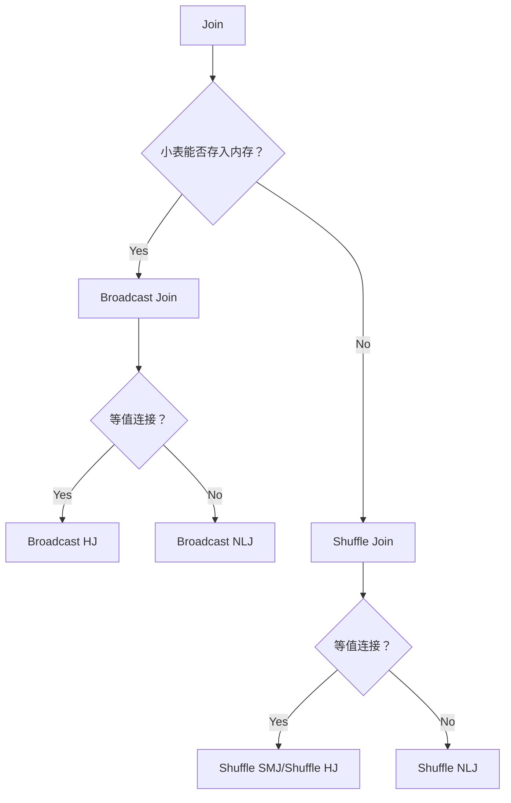

# Spark SQL

## DataFrame & DataSet

DataFrame 是一种**带 Schema 的分布式数据集**，在结构上类似于一张二维表。

DataFrame 背后的计算引擎是 Spark SQL，而 RDD 的计算引擎是 Spark Core。

DataFrame 与 RDD 的主要区别在于，DataFrame 带有 **schema 元信息**。

DataSet 是 DataFrame 的一个扩展。DataSet 是强类型的，支持泛型特性，可以让 Java、Scala 语言更好的利用。


!!! question "有了 RDD 为什么还要 DataFrame？"

    在 RDD 开发框架下，Spark Core 的优化空间受限。绝大多数 RDD 高阶算子所封装的封装的计算逻辑（形参函数 f）对于 Spark Core 是透明的，Spark Core 除了用闭包的方式把函数 f 分发到 Executors 以外，没什么优化余地。而 DataFrame 的出现带来了新思路，它携带的 Schema 提供了丰富的类型信息，而且 DataFrame 算子大多为处理数据列的标量函数。DataFrame 的这两个特点，为引擎内核的优化打开了全新的空间。在 DataFrame 的开发框架下，负责具体优化过程的正是 Spark SQL。

!!! note "Spark Core 和 Spark SQL 的关系"

    Spark SQL，则是凌驾于 Spark Core 之上的一层优化引擎，它的主要职责，**是在用户代码交付 Spark Core 之前，对用户代码进行优化**。

    Spark Core 特指 Spark 底层执行引擎（Execution Engine），它包括了调度系统、存储系统、内存管理、Shuffle 管理等核心功能模块。而 Spark SQL 则凌驾于 Spark Core 之上，是一层独立的优化引擎（Optimization Engine）。换句话说，Spark Core 负责执行，而 Spark SQL 负责优化，Spark SQL 优化过后的代码，依然要交付 Spark Core 来做执行。

    再者，从开发入口来说，在 RDD 框架下开发的应用程序，会直接交付 Spark Core 运行。而使用 DataFrame API 开发的应用，则会先过一遍 Spark SQL，由 Spark SQL 优化过后再交由 Spark Core 去做执行。


### RDD、DataFrame 和 DataSet 的异同

三者的共性：

- RDD、DataFrame、Dataset 都是 Spark 中的分布式弹性数据集，为处理海量数据提供便利
- 三者都有许多相同的概念，如分区、持久化、容错等；有许多共同的函数，如 map, filter, sortBy 等
- 三者都有惰性机制，只有在遇到 Action 算子时，才会开始真正的计算

三者的区别：

- 与 RDD 和 Dataset 不同，DataFrame 每一行的类型固定为 Row，只有通过解析才能获取各个字段的值
- DataFrame 定义为 `Dataset[Row]`。每一行的类型是 Row，然后在 Row 包含具体的字段信息
- Dataset 每一行的类型都是一个 case class，在自定义了 case class 之后可以很自由的获得每一行的信息

---

## Catalyst 优化器

基于 DataFrame，Spark SQL 是如何进行优化的？

- Catalyst 优化器
- Tungsten

Catalyst 优化器，它的职责在于创建并优化执行计划，它包含 3 个功能模块，分别是**创建语法树并生成执行计划**、**逻辑阶段优化**和**物理阶段优化**。

Tungsten 用于衔接 Catalyst 执行计划与底层的 Spark Core 执行引擎，它主要负责优化数据结果与可执行代码。


**逻辑阶段优化：**

像**谓词下推**、**列剪枝**这样的特性，都被称为启发式的规则或策略。而 Catalyst 优化器的核心职责之一，就是在逻辑优化阶段，基于启发式的规则和策略调整、优化执行计划，为物理优化阶段提升性能奠定基础。

**物理阶段优化：**

Catalyst 在物理优化阶段还会进一步优化执行计划。与逻辑阶段主要依赖先验的启发式经验不同，物理阶段的优化，主要依赖各式各样的**统计信息**，如数据表尺寸、是否启用数据缓存、Shuffle 中间文件，等等。换句话说，逻辑优化更多的是一种“经验主义”，而物理优化则是“用数据说话”。

以 Join 为例，执行计划仅交代了两张数据表需要做关联，但是，它并没有交代清楚这两张表具体采用哪种机制来做关联。按照实现机制来分类，数据关联有 3 种实现方式，分别是**嵌套循环连接（NLJ，Nested Loop Join）**、**排序归并连接（Sort Merge Join）**和**哈希连接（Hash Join）**。而按照数据分发方式来分类，数据关联又可以分为 **Shuffle Join** 和 **Broadcast Join** 这两大类。因此，在分布式计算环境中，至少有 6 种 Join 策略供 Spark SQL 来选择。

---

## Tungsten

Tungsten 主要是在**数据结构**和**执行代码**这两个方面，做进一步的优化。数据结构优化指的是 **Unsafe Row** 的设计与实现，执行代码优化则指的是**全阶段代码生成**（WSCG，Whole Stage Code Generation）。

我们先来看看为什么要有 Unsafe Row。对于 DataFrame 中的每一条数据记录，Spark SQL 默认采用 org.apache.spark.sql.Row 对象来进行封装和存储。我们知道，使用 Java Object 来存储数据会引入大量额外的存储开销。

为此，Tungsten 设计并实现了一种叫做 Unsafe Row 的二进制数据结构。**Unsafe Row 本质上是字节数组，它以极其紧凑的格式来存储 DataFrame 的每一条数据记录，大幅削减存储开销，从而提升数据的存储与访问效率。**

接下来，我们再来说说 WSCG：全阶段代码生成。所谓全阶段，其实就是我们在调度系统中学过的 Stage。以图中的执行计划为例，标记为绿色的 3 个节点，在任务调度的时候，会被划分到同一个 Stage。


而代码生成，指的是 Tungsten **在运行时把算子之间的「链式调用」捏合为一份代码**。经过了 Tungsten 的 WSCG 优化之后，Filter、Select 和 Scan 这 3 个算子，会被「捏合」为一个函数 f。这样一来，Spark Core 只需要使用函数 f 来一次性地处理每一条数据，就能**减少不同算子之间数据通信的开销**，一气呵成地完成计算。

---

## Spark Session

The entry point to programming Spark with the Dataset and DataFrame API.

Spark Core 中，如果想要执行应用程序，需要首先构建上下文环境对象 **SparkContext**， Spark SQL 其实可以理解为对 Spark Core 的一种封装，不仅仅在模型上进行了封装，上下文环境对象也进行了封装。**SparkSession** 是 Spark 最新的 SQL 查询起始点。

```scala
SparkSession.builder
  .master("local")
  .appName("Word Count")
  .config("spark.some.config.option", "some-value")
  .getOrCreate()
```

```scala
import org.apache.spark.sql.functions._

val spark = SparkSession.builder()
  .master("local")
  .appName("test")
  .getOrCreate()
val sc = spark.sparkContext
import spark.implicits._
```

---

## 创建 DataFrame


### 从 Driver 创建 DataFrame

**方法一：createDataFrame 方法**

```scala
val seq = List(("Alice", 18), ("Bob", 20), ("Tom", 30))

import org.apache.spark.sql.functions._

val df = spark.createDataFrame(seq)
  .withColumnRenamed("_1", "name")
  .withColumnRenamed("_2", "age")
  .orderBy(desc("age")) // desc 来自于 org.apache.spark.sql.functions._

df.show()
df.printSchema()
```

**方法二：toDF 方法**

我们显示导入了 `spark.implicits` 包中的所有方法，然后通过在集合或 RDD 之上调用 toDF 就能轻松创建 DataFrame。

```scala
val seq = List(("Alice", 18), ("Bob", 20), ("Tom", 30))
val df = spark.createDataFrame(seq).toDF("name", "age")

df.show()
df.printSchema()
```

### 从文件系统创建 DataFrame


**以 CSV 为例：**


**以 Parquet / ORC 为例：**

Parquet 与 ORC，都是应用广泛的**列存（Column-based Store）文件格式**。在传统的行存文件格式中，数据记录以行为单位进行存储。虽然这非常符合人类的直觉，**但在数据的检索与扫描方面，行存数据往往效率低下**。例如，在数据探索、数据分析等数仓应用场景中，我们往往仅需扫描数据记录的某些字段，但在行存模式下，我们必须要扫描全量数据，才能完成字段的过滤。

很多列存格式往往**在文件中记录 Data Schema**，比如 Parquet 和 ORC，它们会利用 Meta Data 数据结构，来记录所存储数据的数据模式。这样一来，在读取类似列存文件时，我们无需再像读取 CSV 一样，去手工指定 Data Schema。

### 从 RDBMS 创建 DataFrame

```scala
spark.read.format("jdbc")
  .option("driver", "com.mysql.jdbc.Driver")
  .option("url", "jdbc:mysql://hostname:port/mysql")
  .option("user", "用户名")
  .option("password","密码")
  .option("numPartitions", 20)
  .option("dbtable", "数据表名 ")
  .load()
```

```scala
val sqlQuery: String = “select * from users where gender = ‘female’”
spark.read.format("jdbc")
  .option("driver", "com.mysql.jdbc.Driver")
  .option("url", "jdbc:mysql://hostname:port/mysql")
  .option("user", "用户名")
  .option("password","密码")
  .option("numPartitions", 20)
  .option("dbtable", sqlQuery)
  .load()
```

---

## 创建 DataSet

```scala
def createDataset[T : Encoder](data: Seq[T]): Dataset[T] = {...}
```

This method requires an **encoder** (**to convert a JVM object of type T to and from the internal Spark SQL representation**).

```scala
import spark.implicits._

case class Person(name: String, age: Int)

val seq = List(Person("Alice", 18), Person("Bob", 20), Person("Tom", 30))

val ds = spark.createDataset(seq)

ds.show()
ds.printSchema()
```

使用 case class 的好处是，**Spark SQL 会自动推断出 case class 的字段名和字段类型**。

---

## RDD、DataFrame、DataSet 的转换

### RDD to DataFrame

方法一：

```scala
import spark.implicits._
val seq = List(("Alice", 18), ("Bob", 20), ("Tom", 30))
val rdd = sc.makeRDD(seq)
val df = rdd.toDF("name", "age")

df.printSchema()
df.show()

val rdd2: RDD[Row] = df.rdd
```

方法二：

```scala
import spark.implicits._
val seq = List(("Alice", 18), ("Bob", 20), ("Tom", 30))

val rdd = sc.makeRDD(seq)
  .map(x => Row(x._1, x._2))

val schema = new StructType()
  .add("name", StringType, nullable = true)
  .add("age", IntegerType, nullable = true)

val df = spark.createDataFrame(rdd, schema)

df.printSchema()
df.show()

val rdd2: RDD[Row] = df.rdd
```

---

### RDD to DataSet

```scala
import spark.implicits._
val seq = List(("Alice", 18), ("Bob", 20), ("Tom", 30))

case class Person(name: String, age: Int)

val rdd = sc.makeRDD(seq)
val ds = rdd.map(x => Person(x._1, x._2)).toDS()

ds.printSchema()
ds.show()

val rdd2: RDD[Row] = ds.rdd
```

---

### DataFrame to DataSet

```scala
import spark.implicits._
val seq = List(("Alice", 18), ("Bob", 20), ("Tom", 30))
val df = seq.toDF("name", "age")
val ds: Dataset[Row] = df.as("alias here")
```

---

### DataSet to DataFrame

```scala
import spark.implicits._
val seq = List(("Alice", 18), ("Bob", 20), ("Tom", 30))

case class Person(name: String, age: Int)

val rdd = sc.makeRDD(seq)
val ds = rdd.map(x => Person(x._1, x._2)).toDS()
val df = ds.toDF()
```

---

## DataFrame 算子


### 同源类算子


### 探索类算子


### 清洗类算子


表格中的最后一个算子是 na，它的作用是选取 DataFrame 中的 null 数据，na 往往要结合 drop 或是 fill 来使用。例如，`employeesDF.na.drop` 用于删除 DataFrame 中带 null 值的数据记录，而 `employeesDF.na.fill(0)` 则将 DataFrame 中所有的 null 值都自动填充为整数零。

### 转换类算子


select 算子在功能方面不够灵活。在灵活性这方面，selectExpr 做得更好。比如说，基于 id 和姓名，我们想把它们拼接起来生成一列新的数据。像这种需求，正是 selectExpr 算子的用武之地。

```scala
employeesDF.selectExpr("id", "name", "concat(id, '_', name) as id_name").show

/** 结果打印
+---+-------+---------+
| id| name| id_name|
+---+-------+---------+
| 1| John| 1_John|
| 2| Lily| 2_Lily|
| 3|Raymond|3_Raymond|
+---+-------+---------+
*/
```

withColumnRenamed 是重命名现有的数据列，而 withColumn 则用于生成新的数据列，这一点上，withColumn 倒是和 selectExpr 有着异曲同工之妙。withColumn 也可以充分利用 Spark SQL 提供的 Built-in Functions 来灵活地生成数据。比如，基于年龄列，我们想生成一列脱敏数据，隐去真实年龄，你就可以这样操作。

```scala
employeesDF.withColumn("crypto", hash($"age")).show

/** 结果打印
+---+-------+---+------+-----------+
| id| name|age|gender| crypto|
+---+-------+---+------+-----------+
| 1| John| 26| Male|-1223696181|
| 2| Lily| 28|Female|-1721654386|
| 3|Raymond| 30| Male| 1796998381|
+---+-------+---+------+-----------+
*/
```

```scala
val seq = Seq( (1, "John", 26, "Male", Seq("Sports", "News")),
  (2, "Lily", 28, "Female", Seq("Shopping", "Reading")),
  (3, "Raymond", 30, "Male", Seq("Sports", "Reading"))
)

val employeesDF: DataFrame = seq.toDF("id", "name", "age", "gender", "interests")
employeesDF.show

/** 结果打印
+---+-------+---+------+-------------------+
| id| name|age|gender| interests|
+---+-------+---+------+-------------------+
| 1| John| 26| Male| [Sports, News]|
| 2| Lily| 28|Female|[Shopping, Reading]|
| 3|Raymond| 30| Male| [Sports, Reading]|
+---+-------+---+------+-------------------+
*/

employeesDF.withColumn("interest", explode($"interests")).show

/** 结果打印
+---+-------+---+------+-------------------+--------+
| id| name|age|gender| interests|interest|
+---+-------+---+------+-------------------+--------+
| 1| John| 26| Male| [Sports, News]| Sports|
| 1| John| 26| Male| [Sports, News]| News|
| 2| Lily| 28|Female|[Shopping, Reading]|Shopping|
| 2| Lily| 28|Female|[Shopping, Reading]| Reading|
| 3|Raymond| 30| Male| [Sports, Reading]| Sports|
| 3|Raymond| 30| Male| [Sports, Reading]| Reading|
+---+-------+---+------+-------------------+--------+
*/
```

### 分析类算子


### 持久化类算子


在 write API 中，mode 用于指定“写入模式”，分别有 Append、Overwrite、ErrorIfExists、Ignore 这 4 种模式，它们的含义与描述如下表所示。


---

## Join 的实现机制和策略


Join 有 3 种实现机制，分别是 **NLJ（Nested Loop Join）**、**SMJ（Sort Merge Join）**和 **HJ（Hash Join）**。

在分布式环境下，从数据分发模式来看，Join 又可以分为 **Shuffle Join** 和 **Broadcast Join** 这两大类。因此，**在分布式计算环境中，至少有 6 种 Join 策略供 Spark SQL 来选择**。

---

### Nested Loop Join

对于参与关联的两张表，如 salaries 和 employees，按照它们在代码中出现的顺序，我们约定俗成地把 salaries 称作“左表”，而把 employees 称作“右表”。在探讨关联机制的时候，我们又常常把左表称作是“驱动表”，而把右表称为“基表”。

一般来说，驱动表的体量往往较大，在实现关联的过程中，驱动表是主动扫描数据的那一方。而基表相对来说体量较小，它是被动参与数据扫描的那一方。

在 NLJ 的实现机制下，算法会使用外、内两个嵌套的 for 循环，来依次扫描驱动表与基表中的数据记录。在扫描的同时，还会判定关联条件是否成立，如内关联例子中的 `salaries("id") === employees("id")`。如果关联条件成立，就把两张表的记录拼接在一起，然后对外进行输出。


不难发现，假设驱动表有 M 行数据，而基表有 N 行数据，那么 NLJ 算法的计算复杂度是 $O(M * N)$。尽管 NLJ 的实现方式简单、直观、易懂，但它的执行效率显然很差。

---

### Sort Merge Join

鉴于 NLJ 低效的计算效率，SMJ 应运而生。Sort Merge Join，顾名思义，SMJ 的实现思路是**先排序、再归并**。给定参与关联的两张表，SMJ 先把他们各自排序，然后再使用独立的游标，对排好序的两张表做归并关联。


SMJ 算法的计算复杂度为 $O(MlogM + NlogN)$。如果两张表已排序，那么 SMJ 的计算复杂度就是 $O(M + N)$。

---

### Hash Join


具体来说，HJ 的计算分为两个阶段，分别是 Build 阶段和 Probe 阶段。在 Build 阶段，在基表之上，算法使用既定的哈希函数构建哈希表，如上图的步骤 1 所示。哈希表中的 Key 是 id 字段应用（Apply）哈希函数之后的哈希值，而哈希表的 Value 同时包含了原始的 Join Key（id 字段）和 Payload。

在 Probe 阶段，算法依次遍历驱动表的每一条数据记录。首先使用同样的哈希函数，以动态的方式计算 Join Key 的哈希值。然后，算法再用哈希值去查询刚刚在 Build 阶段创建好的哈希表。如果查询失败，则说明该条记录与基表中的数据不存在关联关系；相反，如果查询成功，则继续对比两边的 Join Key。如果 Join Key 一致，就把两边的记录进行拼接并输出，从而完成数据关联。

---

### 总结

Join 支持 3 种实现机制，它们分别是 Hash Join、Sort Merge Join 和 Nested Loop Join。三者之中，Hash Join 的执行效率最高，这主要得益于哈希表 $O(1)$ 的查找效率。不过，在 Probe 阶段享受哈希表的“性能红利”之前，Build 阶段得先在内存中构建出哈希表才行。因此，**Hash Join 这种算法对于内存的要求比较高，适用于内存能够容纳基表数据的计算场景。**

相比之下，Sort Merge Join 就没有内存方面的限制。不论是排序、还是合并，SMJ 都可以利用磁盘来完成计算。所以，在稳定性这方面，SMJ 更胜一筹。

与前两者相比，Nested Loop Join 看上去有些多余，嵌套的双层 for 循环带来的计算复杂度最高：$O(M * N)$。不过，尺有所短寸有所长，**执行高效的 HJ 和 SMJ 只能用于等值关联，也就是说关联条件必须是等式**，像 `salaries("id") < employees("id")` 这样的关联条件，HJ 和 SMJ 是无能为力的。相反，**NLJ 既可以处理等值关联（Equi Join），也可以应付不等值关联（Non Equi Join）**，可以说是数据关联在实现机制上的最后一道防线。


---

### Shuffle Join

Spark SQL 默认采用 Shuffle Join 来完成分布式环境下的数据关联。对于参与 Join 的两张数据表，Spark SQL 先是按照如下规则，来决定不同数据记录应当分发到哪个 Executors 中去：

- 根据 Join Keys 计算哈希值
- 将哈希值对并行度（Parallelism）取模

由于左表与右表在并行度（分区数）上是一致的，因此，按照同样的规则分发数据之后，一定能够保证 id 字段值相同的薪资数据与员工数据坐落在同样的 Executors 中。


经过 Shuffle 过后，Join Keys 相同的记录被分发到了同样的 Executors 中去。接下来，在 Reduce 阶段，Reduce Task 就可以使用 HJ、SMJ、或是 NLJ 算法在 Executors 内部完成数据关联的计算。

---

### Broadcast Join

实际上，Spark 不仅可以在普通变量上创建广播变量，**在分布式数据集（如 RDD、DataFrame）之上也可以创建广播变量**。这样一来，对于参与 Join 的两张表，我们可以把其中较小的一个封装为广播变量，然后再让它们进行关联。

```scala
import org.apache.spark.sql.functions.broadcast

// 创建员工表的广播变量
val bcEmployees = broadcast(employees)

// 内关联，PS：将原来的employees替换为bcEmployees
val jointDF: DataFrame = salaries.join(bcEmployees, salaries("id") === employees("id"), "inner")
```

在 Broadcast Join 的执行过程中，Spark SQL 首先从各个 Executors 收集 employees 表所有的数据分片，然后在 Driver 端构建广播变量 bcEmployees。


尽管广播变量的创建与分发同样需要消耗网络带宽，但相比 Shuffle Join 中两张表的全网分发，因为仅仅**通过分发体量较小的数据表来完成数据关联**，Spark SQL 的执行性能显然要高效得多。

---

### Join 策略选择

不论是 Shuffle Join，还是 Broadcast Join，一旦数据分发完毕，理论上可以采用 HJ、SMJ 和 NLJ 这 3 种实现机制中的任意一种，完成 Executors 内部的数据关联。因此，两种分发模式，与三种实现机制，它们组合起来，总共有 6 种分布式 Join 策略，如下图所示。


注意：上图中的 Broadcast SMJ 是灰色的。这是因为 Spark 在能够 Broadcast 其中一张表的前提条件成立的情况下，会优先选择 Broadcast HJ 来完成数据关联，而不会选择性能更差的 Broadcast SMJ。因此 Spark 中实际可用的 Join 策略只有 5 种：

- Broadcast HJ：最优先选择
- Shuffle HJ
- Shuffle SMJ
- Broadcast NLJ
- Shuffle NLJ：又称为 Cartesian Product Join




**不论是等值关联、还是不等值关联，只要 Broadcast Join 的前提条件成立，Spark SQL 一定会优先选择 Broadcast Join 相关的策略。**

**Broadcast Join 得以实施的基础，是被广播数据表的全量数据能够完全放入 Driver 的内存、以及各个 Executors 的内存。**

另外，为了避免因广播表尺寸过大而引入新的性能隐患，Spark SQL 要求被广播表的内存大小不能超过 8GB。

当然，在 Broadcast Join 前提条件不成立的情况下，Spark SQL 就会退化到 Shuffle Join 的策略。在不等值的数据关联中，Spark SQL 只有 Shuffle NLJ 这一种选择。

学习过 Shuffle 之后，我们知道，Shuffle 在 Map 阶段往往会对数据做排序，而这恰恰正中 SMJ 机制的下怀。对于已经排好序的两张表，SMJ 的复杂度是 $O(M + N)$，这样的执行效率与 HJ 的 $O(M)$ 可以说是不相上下。再者，SMJ 在执行稳定性方面，远胜于 HJ，在内存受限的情况下，SMJ 可以充分利用磁盘来顺利地完成关联计算。


!!! question "Broadcast Join 一定比 Shuffle Join 快吗？"

    在进行 Broadcast Join 之前，Spark 需要把处于 Executor 端的数据先发送到 Driver 端，然后 Driver 端制作哈希表之后再把数据广播到 Executor 端。如果我们需要广播的表的数据比较多，那么这个过程就会比较耗时，而且还会占用大量的网络带宽，甚至也有 OOM 的风险。因此，**Broadcast Join 并不一定比 Shuffle Join 快**。

---

### 源码

在 `SparkStrategies.scala` 中，我们可以看到 Spark SQL 中的 Join 策略是如何实现的：

Select the proper physical plan for join based on join strategy hints, the availability of equi-join keys and the sizes of joining relations. Below are the existing join strategies, their characteristics and their limitations.

- **Broadcast hash join (BHJ)**: ==Only supported for equi-joins==, while the join keys do not need to be sortable. ==Supported for all join types except full outer joins==. BHJ usually performs faster than the other join algorithms when the broadcast side is small. However, broadcasting tables is a network-intensive operation and it could cause OOM or perform badly in some cases, especially when the build/broadcast side is big.
- **Shuffle hash join**: ==Only supported for equi-joins==, while the join keys do not need to be sortable. Supported for all join types. Building hash map from table is a memory-intensive operation and it could cause OOM when the build side is big.
- **Shuffle sort merge join (SMJ)**: ==Only supported for equi-joins and the join keys have to be sortable==. Supported for all join types.
- **Broadcast nested loop join (BNLJ)**: Supports both equi-joins and non-equi-joins. Supports all the join types, but the implementation is optimized for: 1) broadcasting the left side in a right outer join; 2) broadcasting the right side in a left outer, left semi, left anti or existence join; 3) broadcasting either side in an inner-like join. For other cases, we need to scan the data multiple times, which can be rather slow.
- **Shuffle-and-replicate nested loop join** (a.k.a. cartesian product join): Supports both equi-joins and non-equi-joins. ==Supports only inner like joins==.

---

**If it is an equi-join**, we first look at the join hints w.r.t. the following order:

1.  broadcast hint: pick broadcast hash join if the join type is supported. If both sides
    have the broadcast hints, choose the smaller side (based on stats) to broadcast.
2.  sort merge hint: pick sort merge join if join keys are sortable.
3.  shuffle hash hint: We pick shuffle hash join if the join type is supported. If both
    sides have the shuffle hash hints, choose the smaller side (based on stats) as the
    build side.
4.  shuffle replicate NL hint: pick cartesian product if join type is inner like.

**If there is no hint or the hints are not applicable**, we follow these rules one by one:

1.  Pick broadcast hash join if one side is small enough to broadcast, and the join type
    is supported. If both sides are small, choose the smaller side (based on stats)
    to broadcast.
2.  Pick shuffle hash join if one side is small enough to build local hash map, and is
    much smaller than the other side, and `spark.sql.join.preferSortMergeJoin` is false.
3.  Pick sort merge join if the join keys are sortable.
4.  Pick cartesian product if join type is inner like.
5.  Pick broadcast nested loop join as the final solution. It may OOM but we don't have
    other choice.

---

## UDF & UDAF

用户可以通过 spark.udf 功能添加自定义函数，实现自定义功能。

```scala
object UDF {
  def main(args: Array[String]): Unit = {
    // 创建运行环境
    val sparkConf = new SparkConf().setMaster("local[*]").setAppName("SparkSQL")
    val spark = SparkSession.builder().config(sparkConf).getOrCreate()
    import spark.implicits._

    val df = spark.read.json("data/user.json")
    df.createOrReplaceTempView("user")

    spark.udf.register("prefixName", (name: String) => {
      "Name: " + name
    })

    spark.sql("select age, prefixName(username) from user").show

    //关闭环境
    spark.close()
  }
}
```

强类型的 Dataset 和弱类型的 DataFrame 都提供了相关的聚合函数， 如 count()， countDistinct()，avg()，max()，min()。除此之外，用户可以设定自己的自定义聚合函数。通过继承 UserDefinedAggregateFunction 来实现用户自定义弱类型聚合函数。从 Spark3.0 版本后，UserDefinedAggregateFunction 已经不推荐使用了。可以统一采用强类型聚合函数 Aggregator。
