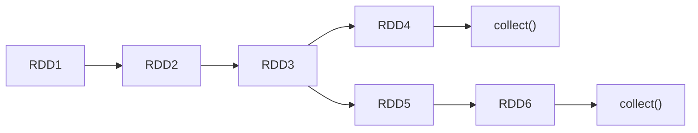

## Spark vs Hadoop

==Spark 是一种基于内存的快速、通用、可扩展的分布式分析计算引擎。==

Hadoop 属于**一次性数据计算**框架：框架在处理数据的时候，会从存储介质中读取数据，进行逻辑操作，然后将处理的结果重新存储回介质中。通过磁盘 IO 进行作业会消耗大量资源和时间，效率很低。

Spark 提供了更丰富的数据处理模型，而且可以**基于内存**进行数据集的多次迭代，速度更快。

==Spark 和 Hadoop 的根本差异是多个作业之间的数据通信问题== : Spark 多个作业之间数据通信是基于内存，而 Hadoop 是基于磁盘。

在绝大多数的数据计算场景中，Spark 确实会比 MapReduce 更有优势。但是 Spark 是基于内存的，所以在实际的生产环境中，由于**内存的限制**，可能会由于内存资源不够导致 Job 执行失败，此时，MapReduce 其实是一个更好的选择，所以 Spark 并不能完全替代 MR。

## Spark 核心模块


## Spark 运行架构

Spark 框架的核心是一个计算引擎，整体来说，它采用了标准 master-slave 的结构。

如下图所示，它展示了一个 Spark 执行时的基本结构。图形中的 Driver 表示 master， 负责管理整个集群中的作业任务调度。图形中的 Executor 则是 slave，负责实际执行任务。


由上图可以看出，对于 Spark 框架有两个核心组件：

- Driver
- Executor

Driver：

Spark 驱动器节点，用于执行 Spark 任务中的 main 方法，负责实际代码的执行工作。 Driver 在 Spark 作业执行时主要负责：

- 将用户程序转化为作业 (job)
- 在 Executor 之间调度任务 (task)
- 跟踪 Executor 的执行情况
- 通过 UI 展示查询运行情况

Executor：

Spark Executor 是集群中工作节点 (Worker) 中的一个 JVM 进程，负责在 Spark 作业中运行具体任务 (Task)，任务彼此之间相互独立。Spark 应用启动时，Executor 节点被同时启动，并且始终伴随着整个 Spark 应用的生命周期而存在。如果有 Executor 节点发生了故障或崩溃，Spark 应用也可以继续执行，会将出错节点上的任务调度到其他 Executor 节点上继续运行。

Executor 有两个核心功能:

- 负责运行组成 Spark 应用的任务，并将结果返回给驱动器进程
- 它们通过自身的块管理器 (Block Manager) 为用户程序中要求缓存的 RDD 提供内存式存储。RDD 是直接缓存在 Executor 进程内的，因此任务可以在运行时充分利用缓存数据加速运算。

## WordCount

注意使用 Maven 创建项目，add framework support for Scala，然后在 Maven 中添加 Spark 依赖，注意必须使用 JDK1.8。

```scala
hello world
hello spark
hi java

hello java
hello spark
hi spark

package com.anson

import org.apache.spark.rdd.RDD
import org.apache.spark.{SparkConf, SparkContext}

object Spark01_WordCount {
  def main(args: Array[String]): Unit = {
    // 建立和Spark框架的连接
    val sparkConf = new SparkConf().setMaster("local").setAppName("WordCount")
    val sc = new SparkContext(sparkConf)

    // 执行业务操作
    // 读取文件，获取一行行的数据
    val lines: RDD[String] = sc.textFile("data")

    // 将一行行的数据进行分词，扁平化 hello, world, hello, spark
    val words: RDD[String] = lines.flatMap(_.split(" "))

    // 分组 (hello, hello, hello), (world, world)
    val wordGroup: RDD[(String, Iterable[String])] = words.groupBy(word => word)

    // 对分组后的数据转换
    val wordToCount = wordGroup.map {
      case (word, list) => {
        (word, list.size)
      }
    }

    // 将结果打印到控制台
    val array: Array[(String, Int)] = wordToCount.collect()
    array.foreach(println)

    // 关闭连接
    sc.stop()
  }
}

```

==RDD 的数据只有在调用 `collect()` 方法时，才会真正执行业务逻辑操作，之前的封装全部都是功能的扩展。类似于 Java 中的 IO 流，都用到了装饰者设计模式。== 但是 RDD 是不保存数据的，IO 会保存一部分数据。

通过 IO 流来理解 RDD：[Link](https://www.bilibili.com/video/BV11A411L7CK?p=27&vd_source=f3af28d1fd89af1eb80db058885d7130) | [Link](https://www.bilibili.com/video/BV11A411L7CK?p=28&vd_source=f3af28d1fd89af1eb80db058885d7130)

---

## Spark 三大数据结构

- RDD：弹性分布式数据集
- 累加器：分布式共享**只写**变量
- 广播变量：分布式共享**只读**变量

### 累加器

累加器用来把 Executor 端变量信息聚合到 Driver 端。在 Driver 程序中定义的变量，在 Executor 端的每个 Task 都会得到这个变量的一份新的副本，每个 task 更新这些副本的值后， 传回 Driver 端进行 merge。

```scala
val rdd = sc.makeRDD(List(1,2,3,4,5))
// 声明累加器
var sum = sc.longAccumulator("sum");
rdd.foreach(
  num => {
    // 使用累加器
    sum.add(num)
  }
)
// 获取累加器的值
println("sum = " + sum.value)
```

==注意：在转换算子中调用累加器，如果没有行动算子的话，那么相当于没有执行，累加器结果会不正确。因此一般情况下累加器要放在行动算子中使用。==

一些思考：一些简单的统计类累加逻辑可以通过自定义累加器解决，这样可以通过使用全局分布式的累加器避免 shuffle。

### 广播变量

广播变量用来高效分发较大的对象。向所有工作节点发送一个较大的只读值，以供一个或多个 Spark 操作使用。比如，如果你的应用需要向所有节点发送一个较大的只读查询表， 广播变量用起来都很顺手。在多个并行操作中使用同一个变量，但是 Spark 会为每个任务分别发送。

==闭包数据，都是以 Task 为单位发送的，每个 Task 中都包含闭包数据可能会导致一个 Executor 中含有大量重复的数据，占用大量的内存。因此，完全可以将任务中的闭包数据放置在 Executor 的内存中，达到共享的目的。==


```scala
// 通过broadcast避免join导致的shuffle
val rdd1 = sc.makeRDD(List(("a", 1), ("b", 2), ("c", 3), ("d", 4)), 4)
val list = List(("a", 4), ("b", 5), ("c", 6), ("d", 7))
// 声明广播变量
val broadcast: Broadcast[List[(String, Int)]] = sc.broadcast(list)
val resultRDD: RDD[(String, (Int, Int))] = rdd1.map {
  case (key, num) => {
    var num2 = 0
    // 使用广播变量
    for ((k, v) <- broadcast.value) {
      if (k == key) {
        num2 = v
      }
    }
    (key, (num, num2))
  }
}
```

---

## RDD 简介

RDD(Resilient Distributed Dataset) 叫做**弹性分布式数据集**，是 Spark 中最基本的数据处理模型。代码中是一个抽象类，它代表一个弹性的、不可变、可分区、里面的元素可并行计算的集合。

> A Resilient Distributed Dataset (RDD), the basic abstraction in Spark. Represents an immutable, partitioned collection of elements that can be operated on in parallel.

弹性：

- 存储的弹性：内存与磁盘的自动切换
- 容错的弹性：基于血缘的高效容错
- 计算的弹性：Task 失败后的自动重试
- 分片的弹性：可根据需要重新分片

分布式：数据存储在大数据集群不同节点上

数据集：RDD 封装了计算逻辑，并不保存数据

数据抽象：RDD 是一个抽象类，需要子类具体实现

不可变：RDD 封装了计算逻辑，是不可以改变的。如果想要改变，只能产生新的 RDD，在新的 RDD 里面封装计算逻辑

可分区、并行计算


RDD 是 Spark 对于分布式数据集的抽象，每一个 RDD 都代表着一种**分布式数据形态**。比如 lineRDD，它表示数据在集群中以行（Line）的形式存在；而 wordRDD 则意味着数据的形态是单词，分布在计算集群中。

---

## RDD 的核心属性

Internally, each RDD is characterized by five main properties:

- A list of partitions
- A function for computing each split
- A list of dependencies on other RDDs
- Optionally, a Partitioner for key-value RDDs (e.g. to say that the RDD is hash-partitioned)
- Optionally, a list of preferred locations to compute each split on (e.g. block locations for an HDFS file)

---

- **分区列表**：每个分区为 RDD 的一部分数据，分区的数量决定了 RDD 的并行度。
- **分区计算函数**：Spark 在计算时，是使用分区函数对每一个分区进行计算。
- **RDD 之间的依赖关系**：RDD 是计算模型的封装，当需求中需要将多个计算模型进行组合时，就需要将多个 RDD 建立依赖关系。
- **分区器 (可选)** ：当数据为 KV 类型数据时，可以指定分区器（Hash/Range/自定义）。
- **首选位置 (可选)**：计算数据时，判断把计算发送到哪个节点效率最优：移动计算，而不是移动数据。

---

总结：

- RDD 可以看做是一系列的分区，每个分区就是一个数据集片段
- RDD 之间存在依赖关系
- 算子是作用在分区之上的
- 分区器是作用在 KV 类型的 RDD 上的
- 移动计算，而不是移动数据

---

## RDD 的执行原理

从计算的角度来讲，数据处理过程中需要计算资源 (内存 & CPU) 和计算模型 (逻辑)。执行时，需要将计算资源和计算模型进行协调和整合。

Spark 框架在执行时，先申请资源，然后将应用程序的数据处理逻辑分解成一个一个的计算任务，然后将任务发到已经分配资源的计算节点上，按照指定的计算模型进行数据计算，最后得到计算结果。


从以上流程可以看出 RDD 在整个流程中主要用于将逻辑进行封装，并生成 Task 发送给 Executor 节点执行计算。

---

## RDD 的创建

在 Spark 中创建 RDD 的创建方式：

- 从集合 (内存) 中创建 RDD
- 从本地文件创建 RDD
- 从 HDFS 读取文件创建 RDD

```scala
object RDD_Memory {
  def main(args: Array[String]): Unit = {
    // 准备环境
    // [*]指当前机器可用核心数，如8核，此时Spark会用8个线程模拟
    val sparkConf = new SparkConf().setMaster("local[*]").setAppName("RDD")
    val sc = new SparkContext(sparkConf)

    // 从内存中创建RDD，将内存中集合的数据作为处理的数据源
    val rdd = sc.parallelize(Array(1, 2, 3, 4, 5))
    // val rdd = sc.makeRDD(Array(1, 2, 3, 4, 5)) // 底层实现就是调用了RDD对象的parallelize()方法
    rdd.collect().foreach(println)

    // 关闭环境
    sc.stop()
  }
}
object RDD_File {
  def main(args: Array[String]): Unit = {
    // 准备环境
    val sparkConf = new SparkConf().setMaster("local[*]").setAppName("RDD")
    val sc = new SparkContext(sparkConf)

    // 从文件中的数据作为数据源
    // 路径默认以当前环境的根路径为基准，绝对、相对路径都行，也可以是目录名
    val rdd = sc.textFile("data/1.txt")
    rdd.collect().foreach(println)

    // 关闭环境
    sc.stop()
  }
}
```

---

## Job、Stage、Task

- 一个 Action 算子对应一个 Job
- Stage 按照宽依赖划分
- 一个分区对应一个 Task

理论上：每一个 Stage 下有多少个分区，就有多少个 Task，Task 的数量就是任务的最大并行度。一般情况下一个 Task 使用一个 core。

实际上：最大的并行度，取决于任务运行时使用的 Executor 拥有的最大核数。

> 如果 Task 的数量超过了核数，那么多出来的 Task 就需要等待之前的 Task 执行完毕后才能执行。

---

## 分区与并行度

默认情况下，Spark 可以将一个作业切分多个任务后，发送给 Executor 节点并行计算，而**能够并行计算的任务数量我们称之为并行度**。这个数量可以在构建 RDD 时指定。

分区数：是一个静态的概念，如果是内存数据，那么分区数和设置的并行度一致；如果是 HDFS 文件，那么分区数就是 HDFS 文件 Block 个数。

并行度：是一个动态的概念，取决于当前资源的可用核数。

并行度小于等于分区数。

```scala
object RDD_Par {
  def main(args: Array[String]): Unit = {
    // 准备环境
    val sparkConf = new SparkConf().setMaster("local[*]").setAppName("RDD")
    val sc = new SparkContext(sparkConf)

    // RDD的并行度和分区
    // makeRDD方法的第二个参数可以设置分区数，默认值为defaultParallelism（默认并行度）,
    // 是从上面的sparkConf中获取的，即当前环境的最大可用核数
    val rdd = sc.makeRDD(List(1, 2, 3, 4), 2)
    rdd.saveAsTextFile("output")

    // 关闭环境
    sc.stop()
  }
}
```

读取**内存数据**时，数据可以按照并行度的设定进行数据的分区操作，数据分区规则的 Spark 核心源码如下：

```scala
def positions(length: Long, numSlices: Int): Iterator[(Int, Int)] = {
  (0 until numSlices).iterator.map { i =>
    val start = ((i * length) / numSlices).toInt
    val end = (((i + 1) * length) / numSlices).toInt
    (start, end)
  }
}
object RDD_Par_File {
  def main(args: Array[String]): Unit = {
    // 准备环境
    val sparkConf = new SparkConf().setMaster("local[*]").setAppName("RDD")
    val sc = new SparkContext(sparkConf)

    // textFile可以将文件作为数据源，默认也可以设置分区（第二个参数）
    // minPartitions：最小分区数量
    // math.min(defaultParallelism, 2)
    val rdd = sc.textFile("data/1.txt", 2)
    rdd.saveAsTextFile("output")

    // 关闭环境
    sc.stop()
  }
}
```

读取**文件数据**时，分区个数默认 = HDFS 文件切片的个数。

假设文件有 7 个字节，`totalSize = 7` ，`goalSize = 7/2 = 3` ，`7/3 = 2 ... 1` ，也就是说 2 个分区够装 6 个字节，还有剩余 1 个字节，但是此时这一个字节 `1/3 = 33.3% > 10%` ，超过了 hadoop 的 1.1 倍原则，会多创建一个分区，因此最终会创建 3 个分区。

Spark 分区数据的分配：

- Spark 读取文件，采取的是 hadoop 的方式读取，即一行一行地读取，和字节数无关。
- 数据读取时以偏移量为单位。

---

## RDD 算子

[RDD Programming Guide - Transformations](https://spark.apache.org/docs/latest/rdd-programming-guide.html#transformations)

[RDD Programming Guide - Actions](https://spark.apache.org/docs/latest/rdd-programming-guide.html#actions)

算子：即 RDD 的方法。

- **分布式集合对象上的 API 称之为算子**。
- 本地对象的 API 称之为方法。

RDD 算子分为两大类：Transformation 和 Action。

- Transformation：转换算子，将原有 RDD 转换为新的 RDD，**懒加载，不会触发作业的执行**。
- Action：行动算子，触发作业的执行。


---

## RDD 序列化

闭包检测：

从计算的角度, 算子以外的代码都是在 Driver 端执行, 算子里面的代码都是在 Executor 端执行。那么在 scala 的函数式编程中，就会导致算子内经常会用到算子外的数据，这样就形成了闭包的效果，如果使用的算子外的数据无法序列化，就意味着无法传值给 Executor 端执行，就会发生错误，所以需要在执行任务计算前，检测闭包内的对象是否可以进行序列化，这个操作我们称之为**闭包检测**。

序列化方法和属性：

从计算的角度, 算子以外的代码都是在 Driver 端执行, 算子里面的代码都是在 Executor 端执行。

```scala
object RDD_Serialize {
  def main(args: Array[String]): Unit = {
    val sparkConf = new SparkConf().setMaster("local[*]").setAppName("Serialize")
    val sc = new SparkContext(sparkConf)

    val rdd = sc.makeRDD(List(1, 2, 3, 4))
    val user = new User()

    rdd.foreach(
      num => {
        println("age = " + (user.age + num))
      }
    )

    sc.stop()
  }

  class User {
    var age: Int = 30
  }
}
```

上面的代码会报 Task not serializable 异常，原因是 user 对象没有序列化。解决方法一是在 class User 后面混入 Serializable 特质。另一种方法是用样例类代替 class。样例类会在编译的时候自动完成序列化。

```scala
case class User() {
  var age: Int = 30
}
```

Kryo 序列化框架：

Java 的序列化能够序列化任何的类。但是比较重 (字节多)，序列化后，对象的提交也比较大。Spark 出于性能的考虑，Spark2.0 开始支持另外一种 Kryo 序列化机制。Kryo 速度是 Serializable 的 10 倍。当 RDD 在 Shuffle 数据的时候，简单数据类型、数组和字符串类型已经在 Spark 内部使用 Kryo 来序列化。

注意：即使使用 Kryo 序列化，也要继承 Serializable 接口。

---

## RDD 依赖关系

相邻的两个 RDD 的关系被称为**依赖关系**。多个连续的 RDD 的依赖关系被称为**血缘关系**。

每个 RDD 都会保存血缘关系。由于 RDD 是不会保存数据的（不落盘，通过内存传递），因此为了提供容错性，需要将 RDD 间的关系保存下来，一旦出现错误，可以根据血缘关系重新读取进行计算。

> RDD 只支持粗粒度转换，即在大量记录上执行的单个操作。将创建 RDD 的一系列 Lineage (血统) 记录下来，以便恢复丢失的分区。RDD 的 Lineage 会记录 RDD 的元数据信息和转换行为，当该 RDD 的部分分区数据丢失时，它可以根据这些信息来重新运算和恢复丢失的数据分区。

通过每次生成 RDD 之后调用 `rdd.toDebugString` 即可查看当前 RDD 的血缘关系。通过调用 `rdd.dependencies` 可以查看当前 RDD 的依赖关系。


如果父 RDD 中一个分区的数据只流向子 RDD 中的一个分区（出度 = 1），这种依赖被称为 **OneToOne 依赖**，也叫**窄依赖**。

如果父 RDD 中一个分区的数据流向子 RDD 中的多个分区（出度 > 1），这种依赖被称为 **Shuffle 依赖**，也叫**宽依赖**。

---

## RDD 阶段划分

DAG 记录了 RDD 的转换过程和任务的阶段（stage）。


RDD 任务切分中间分为：Application、Job、Stage 和 Task。

- Application：初始化一个 SparkContext 即生成一个 Application
- Job：一个 Action 算子就会生成一个 Job
- Stage：Stage 等于宽依赖 (ShuffleDependency) 的个数加 1
- Task：一个 Stage 阶段中，最后一个 RDD 的分区个数就是 Task 的个数

所谓 Stage 划分算法就是：从最后一个 RDD 往前推算，遇到窄依赖就将其加入该 Stage，遇到宽依赖则断开，生成一个新的 Stage。**每个 Stage 里 Task 的数量由 Stage 中最后一个 RDD 的分区数量决定。**

---

## RDD 持久化

RDD 的数据是过程数据，不是结果数据，新的 RDD 生成，老的 RDD 消失。所以在使用 RDD 时，可按需将 RDD 的数据持久化到内存或者磁盘中，以便后续使用。



如上图，RDD3 在第一次使用后，就从内存中释放了，第二次使用的时候，只能基于血缘关系，从 RDD1 开始重新计算。此时可以将 RDD3 持久化到内存中，这样第二次使用的时候，就可以直接从内存中获取。

### RDD 缓存/持久化

- `rdd.cache()`：将 RDD 持久化到内存中
- `rdd.persist()`：将 RDD 持久化到内存或磁盘中
- `rdd.unpersist()`：将 RDD 从缓存中移除

缓存在设计上是认为有丢失风险的，因此，缓存会保留 RDD 之间的血缘关系。缓存如果丢失，则可以按照血缘关系重新计算。同时，缓存是分散存储在各个 Executor 上的。

```python
rdd.cache()
rdd.persist(StorageLevel.MEMORY_ONLY)
rdd.persist(StorageLevel.MEMORY_AND_DISK) # 先放内存，不够放磁盘
rdd.persist(StorageLevel.DISK_ONLY)
rdd.persist(StorageLevel.DISK_ONLY_2) # 2 代表副本数
rdd.persist(StorageLevel.DISK_ONLY_3)
```

---

### RDD Checkpoint

所谓的检查点其实就是通过将 RDD 中间结果写入磁盘由于血缘依赖过长会造成容错成本过高，这样就不如在中间阶段做检查点容错，如果检查点之后有节点出现问题，可以从检查点开始重做血缘，减少了开销。

RDD Checkpoint 也是将 RDD 进行持久化，但是**只支持硬盘存储**。和缓存不同，Checkpoint 被认为是安全的，**会切断 RDD 的血缘关系**。

我们知道缓存是分散存储在各个 Executor 上的，Checkpoint 是**收集各个分区的数据，集中存储在一个地方**，这个地方可以是 HDFS、本地文件系统等。

!!! note "Cache VS Checkpoint"

- Cache 是轻量化保存 RDD 数据，分散存储，可持久化到内存或磁盘，设计上是不安全的，会保留 RDD 血缘关系
- Checkpoint 是重量级保存 RDD 数据，集中存储，只能持久化到磁盘，设计上是安全的，会切断 RDD 血缘关系
- Cache 性能更好，因为是分散存储，各个 Executor 并行执行，效率高
- Checkpoint 性能较差，因为是集中存储，需要将数据从各个 Executor 收集到 Driver

---

## RDD 分区器

Spark 目前支持 Hash 分区、Range 分区和用户自定义分区。Hash 分区为当前的默认分区。分区器直接决定了 RDD 中分区的个数、RDD 中每条数据经过 Shuffle 后进入哪个分区，进而决定了 Reduce 的个数。

- 只有 Key-Value 类型的 RDD 才有分区器，非 Key-Value 类型的 RDD 分区的值是 None
- 每个 RDD 的分区 ID 范围：0 ~ (numPartitions - 1)，决定这个值是属于那个分区的

Hash 分区：对于给定的 key，计算其 hashCode，并除以分区个数取余

Range 分区：将一定范围内的数据映射到一个分区中，尽量保证每个分区数据均匀，而且分区间有序

---

## Shuffle 机制

[Spark shuffle introduction | PPT (slideshare.net)](https://www.slideshare.net/colorant/spark-shuffle-introduction?from_action=save)

[Spark Shuffle Deep Dive (Explained In Depth) - How Shuffle Works in Spark | PPT (slideshare.net)](https://www.slideshare.net/bobyangbo/spark-shuffle-deep-dive-how-shuffle-works-in-spark?from_search=1)

Shuffle 在分布式计算场景中，它被引申为**集群范围内跨节点、跨进程的数据分发**。分布式数据集在集群内的分发，会引入大量的**磁盘 I/O** 与**网络 I/O**。


如上图所示，以 Shuffle 为边界，reduceByKey 的计算被切割为两个执行阶段。约定俗成地，我们把 Shuffle 之前的 Stage 叫作 **Map 阶段**，而把 Shuffle 之后的 Stage 称作 **Reduce 阶段**。

> Map 阶段和 Reduce 阶段之间如何完成数据交换？
>
> 通过生产与消费 Shuffle 中间文件的方式，来完成集群范围内的数据交换。


在 Map 执行阶段，每个 Task 都会**生成包含 data 文件与 index 文件的 Shuffle 中间文件**，如上图所示。也就是说，Shuffle 文件的生成，**是以 Map Task 为粒度的**，Map 阶段有多少个 Map Task，就会生成多少份 Shuffle 中间文件。

### Shuffle Write


在生成中间文件的过程中，Spark 会借助一种类似于 Map 的数据结构，来计算、缓存并排序数据分区中的数据记录。这种 Map 结构的 Key 是（Reduce Task Partition ID，Record Key），而 Value 是原数据记录中的数据值。

当 Map 结构被填充满之后，Spark 根据主键对 Map 中的数据记录做排序，然后把所有内容溢出到磁盘中的临时文件。如此往复，直到数据分区中所有的数据记录都被处理完毕。

磁盘上存有若干个溢出的临时文件，而内存的 Map 结构中留有部分数据，Spark 使用归并排序算法对所有临时文件和 Map 结构剩余数据做合并，分别生成 data 文件、和与之对应的 index 文件。

总结：

1. 对于数据分区中的数据记录，逐一计算其目标分区，然后填充内存数据结构；
2. 当数据结构填满后，如果分区中还有未处理的数据记录，就对结构中的数据记录按（目标分区 ID，Key）排序，将所有数据溢出到临时文件，同时清空数据结构；
3. 重复前 2 个步骤，直到分区中所有的数据记录都被处理为止；
4. 对所有临时文件和内存数据结构中剩余的数据记录做归并排序，生成数据文件和索引文件。

---

### Shuffle Read

对于每一个 Map Task 生成的中间文件，其中的目标分区数量是由 Reduce 阶段的任务数量（又叫**并行度**）决定的。在下面的示意图中，Reduce 阶段的并行度是 3，因此，Map Task 的中间文件会包含 3 个目标分区的数据，而 **index 文件，恰恰是用来标记目标分区所属数据记录的起始索引**。


对于所有 Map Task 生成的中间文件，Reduce Task 需要通过网络从不同节点的硬盘中下载并拉取属于自己的数据内容。不同的 Reduce Task 正是根据 index 文件中的起始索引来确定哪些数据内容是“属于自己的”。

---
