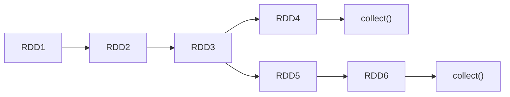

## Spark 框架

Spark 是一种**基于内存**的快速、通用、可扩展的**分布式分析计算引擎**。

Spark 借鉴了 MapReduce 思想发展而来，保留了其分布式并行计算的优点并改进了其明显的缺陷。让中间数据存储在内存中提高了运行速度、并提供丰富的操作数据的 API 提高了开发速度。

Spark 处理数据与 MapReduce 处理数据相比，有如下两个不同点：

- Spark 处理数据时，可以将中间处理结果数据存储到**内存**中
- Spark 提供了非常丰富的算子(API), 可以做到复杂任务在**一个 Spark 程序**中完成

!!! note "Spark VS Hadoop"


!!! question "Hadoop 的基于进程的计算和 Spark 基于线程方式优缺点？"

Hadoop 中的 MR 中每个 Map/Reduce Task 都是一个 Java 进程方式运行，好处在于进程之间是互相独立的，每个 Task 独享进程资源，没
有互相干扰，监控方便，但是**问题在于 Task 之间不方便共享数据，执行效率比较低**。比如多个 Map Task 读取不同数据源文件需要将数据源加
载到每个 Map Task 中，造成重复加载和浪费内存。

而 Spark **基于线程的方式计算是为了数据共享和提高执行效率**，Spark 采用线程为最小的执行单位，但**缺点是线程之间会有资源竞争**。

---

### Spark 核心模块


- Spark Core：是 Spark 运行的基础。Spark Core 以 RDD 为数据抽象，提供 Python、Java、Scala、R 语言的 API，可以编程进行海量离线数据批处理计算。
- SparkSQL：基于 Spark Core 之上，提供结构化数据的处理模块。SparkSQL 支持以 SQL 语言对数据进行处理，SparkSQL 本身针对离线计算场景。同时基于 SparkSQL，Spark 提供了 StructuredStreaming 模块，可以以 SparkSQL 为基础，进行数据的流式计算。
- SparkStreaming：以 Spark Core 为基础，提供数据的流式计算功能。
- MLlib：基于 Spark Core 之上，提供机器学习的功能库。
- GraphX：基于 Spark Core 之上，提供图计算的功能库。

---

### Spark 运行模式

- 本地模式（单机）：本地模式就是以一个**独立的进程**，通过其内部的**多个线程来模拟**整个 Spark 运行时环境
- Standalone 模式（集群）：Spark 中的各个角色以独立进程的形式存在，并组成 Spark 集群环境
- Spark on YARN 模式（集群）：Spark 中的各个角色运行在 YARN 的容器内部，并组成 Spark 集群环境
- Spark on Kubernetes 模式（集群）：Spark 中的各个角色运行在 Kubernetes 的容器内部，并组成 Spark 集群环境

---

### Spark 的架构角色


Spark 采用了标准的主从架构。

- Master：管理整个集群的资源，类似于 YARN 的 ResourceManager
- Worker：管理单个服务器的资源，类似于 YARN 的 NodeManager
- Driver：管理单个 Spark 任务在运行时的工作，类似于 YARN 的 ApplicationMaster
- Executor：负责具体的任务执行，类似于 YARN 容器中运行的 Task

---

### 常用端口

- 4040：Application 在运行的过程中临时绑定的端口，用于查看当前任务的状态。4040 被占用会顺延到 4041，4042 等，4040 是一个临时端口,当前程序运行完成后, 4040 就会被注销
- 8080：默认是 StandAlone 模式下, Master 角色(进程)的 WEB UI 端口，用以查看当前 Master(集群)的状态
- 18080：默认是历史服务器的端口, 由于每个程序运行完成后，4040 端口就被注销了，在以后想回看某个程序的运行状态就可以通过历史服务器查看

---

### Spark 的 Job、Stage、Task

Spark Application 程序运行时三个核心概念：Job、Stage、Task，说明如下：

- Job：由多个 Task 的并行计算部分，一般 Spark 中的 action 操作（如 save、collect），会
  生成一个 Job。
- Stage：Job 的组成单位，一个 Job 会切分成多个 Stage，Stage 彼此之间相互依赖顺序执行，而每个 Stage 是多个 Task 的集合，类似 map 和 reduce stage。
- Task：被分配到各个 Executor 的单位工作内容，它是 Spark 中的最小执行单位，一般来说有多少个 Paritition（物理层面的概念，即分支可以理解为将数据划分成不同部分并行处理），就会有多少个 Task，每个 Task 只会处理单一分支上的数据。

---

### WordCount 案例

```python
# 获取 SparkContext 对象，作为执行环境的入口
conf = SparkConf().setMaster("local[*]").setAppName("HelloWorld")
sc = SparkContext(conf=conf)

file_rdd = sc.textFile("data/words.txt")
rdd = ((((file_rdd
            .flatMap(lambda line: line.split(" ")))
            .map(lambda word: (word, 1)))
            .reduceByKey(lambda a, b: a + b))
            .collect())
print(rdd)
```


- SparkContext 对象的构建，以及 Spark 程序的退出, 由 Driver 负责执行
- 具体的数据处理步骤, 由 Executor 执行

即：

- 非数据处理的部分由 Driver 负责
- 数据处理的部分由 Executor 负责

---

### Spark 程序流程

1. Driver 构建 SparkContext 对象，序列化 SparkContext 对象发送到各个 Executor
2. Driver 构建 Job 并划分 Stage，将 Stage 以 TaskSet 的形式发送到各个 Executor
3. Executor 根据 TaskSet 中的 Task 信息，启动 Task 并执行
4. Task 执行完毕，将结果返回给 Driver
5. Driver 将结果汇总后返回给用户

---

### Python on Spark 执行原理

PySpark 宗旨是在不破坏 Spark 已有的运行时架构，在 Spark 架构外层包装一层 Python API，借助 Py4j 实现 Python 和
Java 的交互，进而实现通过 Python 编写 Spark 应用程序，其运行时架构如下图所示。


在 Driver 端，Python 的 Driver 代码翻译成 JVM 代码（Py4j），变成 JVM Driver 运行。

Driver 的操作指令发送给 JVM Executor 端，JVM Executor 通过 PySpark 守护进程将指令发送给运行的 Python Executor 进程上运行。

总结：

- Driver 端是 JVM Driver
- Executor 端是 Python Executor


---

## Spark Core

### RDD

RDD(Resilient Distributed Dataset) 叫做**弹性分布式数据集**，是 Spark 中最基本的数据处理模型。代码中是一个抽象类，它代表一个弹性的、不可变、可分区、里面的元素可并行计算的集合。

弹性：

- 存储的弹性：内存与磁盘的自动切换
- 分区的弹性：可根据需要重新分区

分布式：数据存储在大数据集群不同节点上

数据集：RDD 封装了计算逻辑，并不保存数据

数据抽象：RDD 是一个抽象类，需要子类具体实现

不可变：RDD 封装了计算逻辑，是不可以改变的。如果想要改变，只能产生新的 RDD，在新的 RDD 里面封装计算逻辑

可分区、并行计算

RDD 的数据只有在调用 `collect()` 方法时，才会真正执行业务逻辑操作，之前的封装全部都是功能的扩展。类似于 Java 中的 IO 流，都用到了装饰者设计模式。但是 RDD 是不保存数据的，IO 会保存一部分数据。

---

### RDD 的核心属性/五大特性

Internally, each RDD is characterized by five main properties:

- A list of partitions
- A function for computing each split
- A list of dependencies on other RDDs
- Optionally, a Partitioner for key-value RDDs (e.g. to say that the RDD is hash-partitioned)
- Optionally, a list of preferred locations to compute each split on (e.g. block locations for an HDFS file)

翻译过后：

- 分区列表：RDD 数据结构中存在分区列表，用于执行任务时并行计算，是实现分布式计算的重要属性。
- 分区计算函数：Spark 在计算时，使用分区函数对每一个分区进行计算。
- RDD 之间的依赖关系：RDD 是计算模型的封装，当需求中需要将多个计算模型进行组合时，就需要将多个 RDD 建立依赖关系。
- 分区器 (可选) ：当数据为 KV 类型数据时，可以通过设定分区器自定义数据的分区。
- 首选位置 (可选)：计算数据时，可以根据计算节点的状态选择不同的节点位置进行计算。即判断把计算发送到哪个节点效率最优：移动计算，而不是移动数据。

> 特性一：RDD 是有分区的

```python
rdd = sc.parallelize([1, 2, 3, 4, 5, 6, 7, 8, 9], 3)
print(rdd.glom().collect())
# [[1, 2, 3], [4, 5, 6], [7, 8, 9]]
```

> 特性二：RDD 的计算函数会作用在每一个分区上

```python
rdd = sc.parallelize([1, 2, 3, 4, 5, 6, 7, 8, 9], 3).map(lambda x: x * 2)
print(rdd.glom().collect())
# [[2, 4, 6], [8, 10, 12], [14, 16, 18]]
```

> 特性三：RDD 之间有依赖关系（血缘关系）

```python
rdd1 = sc.textFile("data/words.txt")
rdd2 = rdd1.flatMap(lambda line: line.split(" "))
rdd3 = rdd2.map(lambda word: (word, 1))
rdd4 = rdd3.reduceByKey(lambda a, b: a + b)
print(rdd4.collect())

# 血缘关系：rdd1 -> rdd2 -> rdd3 -> rdd4
```

> 特性四：KV 型的 RDD 可以自定义数据的分区

KV 型的数据：如二元组 `("hello", 1)`

默认分区器：Hash 分区器，可以手动设置一个分区器（rdd.partitionBy）

> 特性五：RDD 的分区规划，会尽量靠近数据所在的服务器

Spark 会在确保并行计算能力的前提下，尽量保证本地读取，避免网络传输。


---

### RDD 的执行原理

从计算的角度来讲，数据处理过程中需要计算资源 (内存 & CPU) 和计算模型 (逻辑)。执行时，需要将计算资源和计算模型进行协调和整合。

Spark 框架在执行时，先申请资源，然后将应用程序的数据处理逻辑分解成一个一个的计算任务，然后==将任务发到已经分配资源的计算节点上==，按照指定的计算模型进行数据计算，最后得到计算结果。


从以上流程可以看出 RDD 在整个流程中主要用于将逻辑进行封装，并生成 Task 发送给 Executor 节点执行计算。

---

### RDD 的创建

在 Spark 中创建 RDD 的创建方式可以分为四种：

- 从集合 (内存) 中创建 RDD
- 从外部存储 (文件) 创建 RDD
- 从其他 RDD 创建
- 直接创建 RDD(new)

我们常用前 2 种。

从内存中创建：

```python
rdd = sc.parallelize([1, 2, 3, 4, 5, 6, 7, 8, 9])
print(rdd.getNumPartitions()) # local[*] 默认 CPU 核心数

rdd = sc.parallelize([1, 2, 3, 4, 5, 6, 7, 8, 9], 3)
# 将 RDD 中每个分区的数据，都发送到 Driver 中，形成一个 Python List
print(rdd.collect())
```

从文件中创建：

```python
rdd = sc.textFile("../data/words.txt")
print(rdd.getNumPartitions())  # 2，与文件大小有关

rdd = sc.textFile("../data/words.txt", 3)
print(rdd.getNumPartitions())  # 3 只是最小分区数，实际分区数由文件大小决定

# 如果小文件很多，可以使用 sc.wholeTextFiles(文件夹) 方法，将多个小文件合并成一个分区
```

---

### RDD 算子

算子：即 RDD 的方法。

- **分布式集合对象上的 API 称之为算子**。
- 本地对象的 API 称之为方法。

RDD 算子分为两大类：Transformation 和 Action。

- Transformation：转换算子，将原有 RDD 转换为新的 RDD，**懒加载，不会触发作业的执行**。
- Action：行动算子，触发作业的执行。

---

### RDD 的持久化

RDD 的数据是过程数据，不是结果数据，新的 RDD 生成，老的 RDD 消失。所以在使用 RDD 时，可按需将 RDD 的数据持久化到内存或者磁盘中，以便后续使用。



如上图，RDD3 在第一次使用后，就从内存中释放了，第二次使用的时候，只能基于血缘关系，从 RDD1 开始重新计算。此时可以将 RDD3 持久化到内存中，这样第二次使用的时候，就可以直接从内存中获取。

#### RDD 缓存/持久化

- `rdd.cache()`：将 RDD 持久化到内存中
- `rdd.persist()`：将 RDD 持久化到内存或磁盘中
- `rdd.unpersist()`：将 RDD 从缓存中移除

缓存在设计上是认为有丢失风险的，因此，缓存会保留 RDD 之间的血缘关系。缓存如果丢失，则可以按照血缘关系重新计算。同时，缓存是分散存储在各个 Executor 上的。

```python
rdd.cache()
rdd.persist(StorageLevel.MEMORY_ONLY)
rdd.persist(StorageLevel.MEMORY_AND_DISK) # 先放内存，不够放磁盘
rdd.persist(StorageLevel.DISK_ONLY)
rdd.persist(StorageLevel.DISK_ONLY_2) # 2 代表副本数
rdd.persist(StorageLevel.DISK_ONLY_3)
```

---

#### RDD Checkpoint

所谓的检查点其实就是通过将 RDD 中间结果写入磁盘由于血缘依赖过长会造成容错成本过高，这样就不如在中间阶段做检查点容错，如果检查点之后有节点出现问题，可以从检查点开始重做血缘，减少了开销。

RDD Checkpoint 也是将 RDD 进行持久化，但是**只支持硬盘存储**。和缓存不同，Checkpoint 被认为是安全的，**会切断 RDD 的血缘关系**。

我们知道缓存是分散存储在各个 Executor 上的，Checkpoint 是**收集各个分区的数据，集中存储在一个地方**，这个地方可以是 HDFS、本地文件系统等。

!!! note "Cache VS Checkpoint"

- Cache 是轻量化保存 RDD 数据，分散存储，可持久化到内存或磁盘，设计上是不安全的，会保留 RDD 血缘关系
- Checkpoint 是重量级保存 RDD 数据，集中存储，只能持久化到磁盘，设计上是安全的，会切断 RDD 血缘关系
- Cache 性能更好，因为是分散存储，各个 Executor 并行执行，效率高
- Checkpoint 性能较差，因为是集中存储，需要将数据从各个 Executor 收集到 Driver

---

### 共享变量

#### 广播变量

广播变量（Broadcast Variables）是一种用于高效分发较大数据集给所有工作节点的机制。它们可以用于**在每个节点上缓存一个只读的大型变量，以便在并行操作中共享**。

> 广播变量解决了什么问题？
>
> 分布式集合 RDD 和本地集合进行关联使用的时候，降低内存占用并减少网络 I/O，提高性能。

由于 Executor 是进程，进程内各线程资源共享，因此，可以将数据放置在 Executor 的内存中，达到共享的目的。

相比于闭包数据都是以 Task 为单位发送的，每个 Task 中都包含闭包数据可能会导致一个 Executor 中含有大量重复的数据，占用大量的内存。因此，完全可以将任务中的闭包数据放置在 Executor 的内存中，达到共享的目的。


```python
from pyspark import SparkConf, SparkContext

conf = SparkConf().setAppName("BroadcastExample").setMaster("local")
sc = SparkContext(conf=conf)

# 创建要广播的变量
broadcast_var = sc.broadcast([1, 2, 3, 4, 5])

# 在工作节点上访问广播变量
result = sc.parallelize([2, 4, 6, 8, 10]).map(lambda x: x * sum(broadcast_var.value))

result.foreach(print)

sc.stop()
```

---

#### 累加器

累加器用来把 Executor 端变量信息聚合到 Driver 端。在 Driver 程序中定义的变量，在 Executor 端的每个 Task 都会得到这个变量的一份新的副本，每个 task 更新这些副本的值后， 传回 Driver 端进行 merge。

注意：在转换算子中调用累加器，如果没有行动算子的话，那么相当于没有执行，累加器结果会不正确。因此一般情况下累加器要放在行动算子中使用。同时注意，如果使用累加器的 RDD 被多次行动算子使用，那么累加器会被多次调用，这样可能会导致产生非预期的结果（建议在行动算子前 `cache()`）。

一些思考：一些简单的统计类累加逻辑可以通过自定义累加器解决，这样可以通过使用全局分布式的累加器避免 shuffle。

> 累加器解决了什么问题？
>
> 在分布式代码执行中，进行全局累加。

在 Apache Spark 中，累加器（Accumulators）是一种用于在并行操作中聚合值的特殊变量。它们用于在分布式计算中收集和更新数据的总和、计数等聚合结果，并且可以通过 Spark 的执行引擎在集群上进行并行计算。

累加器的主要特点是它们只能通过关联和交换操作进行更新，并且只有驱动程序可以访问它们的值。工作节点上的任务只能对累加器进行增加操作，而不能读取其值或进行其他操作。这使得累加器适用于在并行计算中进行计数、求和、平均值等聚合操作。

Spark 中的累加器有两种类型：

- **普通累加器（Accumulator）**：普通累加器用于对数值类型进行聚合操作，例如整数、浮点数等。可以使用 `SparkContext` 的 `accumulator()` 方法创建普通累加器，然后在任务中使用 `+=` 运算符对其进行增加操作。

以下是一个示例代码，展示了如何使用普通累加器对 RDD 中的元素进行求和：

```python
from pyspark import SparkConf, SparkContext

conf = SparkConf().setAppName("AccumulatorExample").setMaster("local")
sc = SparkContext(conf=conf)

# 创建一个普通累加器
sum_accumulator = sc.accumulator(0)

# 在任务中使用累加器进行求和操作
def add_to_accumulator(x):
    global sum_accumulator
    sum_accumulator += x

rdd = sc.parallelize([1, 2, 3, 4, 5, 6, 7, 8, 9, 10], 2)
rdd.foreach(add_to_accumulator)

print("Sum:", sum_accumulator.value)

sc.stop()
```

- **自定义累加器（Custom Accumulator）**：自定义累加器可以用于更复杂的聚合操作，例如字符串拼接、集合操作等。你可以通过继承 `AccumulatorParam` 类，并实现 `zero()` 和 `addInPlace()` 方法来创建自定义累加器。

以下是一个示例代码，展示了如何创建一个自定义累加器来统计 RDD 中不同单词的数量：

```python
from pyspark import SparkConf, SparkContext
from pyspark.accumulators import AccumulatorParam

class WordCountAccumulator(AccumulatorParam):
    def zero(self, initialValue):
        return {}

    def addInPlace(self, v1, v2):
        for word, count in v2.items():
            v1[word] = v1.get(word, 0) + count
        return v1

conf = SparkConf().setAppName("CustomAccumulatorExample").setMaster("local")
sc = SparkContext(conf=conf)

# 创建一个自定义累加器
word_count_accumulator = sc.accumulator({}, WordCountAccumulator())

# 在任务中使用累加器进行单词计数
def count_words(line):
    global word_count_accumulator
    words = line.split()
    word_count = {}
    for word in words:
        word_count[word] = word_count.get(word, 0) + 1
    word_count_accumulator += word_count

rdd = sc.parallelize(["Hello Spark", "Hello Accumulator", "Spark is powerful"])
rdd.foreach(count_words)

print("Word Count:", word_count_accumulator.value)

sc.stop()
```

---

#### 广播变量、累加器案例

在 `data/abnormal.txt` 文件中，有一些单词是异常的，如下所示：

```text
     hadoop spark # hadoop spark
mapreduce  !  spark spark hive !
hive spark %
, hdfs hive spark

   #
```

现在需要统计出文件中正常单词和异常单词的数量，可以使用广播变量和累加器来实现。

```python
from pyspark import SparkConf, SparkContext
import re

conf = SparkConf().setAppName("AccumulatorExample").setMaster("local")
sc = SparkContext(conf=conf)

abnormal_chars = [",", ".", "!", "#", "$", "%"]

# 广播变量
broadcast = sc.broadcast(abnormal_chars)
# 累加器
accumulator_abnormal = sc.accumulator(0)
accumulator_normal = sc.accumulator(0)


def map_func(word):
    global accumulator_abnormal, accumulator_normal
    if word in broadcast.value:
        accumulator_abnormal += 1
    else:
        accumulator_normal += 1


rdd = (sc.textFile("data/abnormal.txt")
       .filter(lambda line: line.strip())  # 去除空行
       .map(lambda x: x.strip())
       .flatMap(lambda line: re.split("\\s+", line))  # 正则表达式，一个或多个空格
       .map(map_func)
       .collect())

print("abnormal: ", accumulator_abnormal.value)
print("normal: ", accumulator_normal.value)
```

---

### Spark 内核

#### DAG
