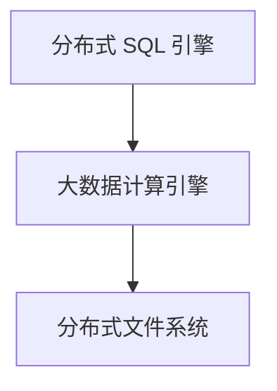

# 数仓理论

## 数据库 VS 数据仓库

**数据库：**

数据库是面向业务的处理系统，它是针对具体业务在数据库联机的日常操作，通常对记录进行查询、修改。用户较为关心操作的响应时间、数据的安全性、完整性和并发支持的用户数等问题。传统的数据库系统作为数据管理的主要手段，主要用于操作型处理，也被称为**联机事务处理 OLTP**。

**数据仓库：**

面向主题的、集成的、非易失的且随时间变化的**数据集合**。

数据仓库一般**针对某些主题的历史数据进行分析**，支持管理决策，又被称为**联机分析处理 OLAP**。

!!! note "区别"

    - 数据库是面向事务的设计，数据仓库是面向主题设计的。
    - 数据库一般存储业务数据，数据仓库存储的一般是历史数据。
    - 数据库设计是尽量避免冗余，常采用符合范式规范来设计。数据仓库设计关注数据整合、分析、处理性能，有意引入冗余，采用反范式设计。
    - 数据库主要操作是随机读写，数据仓库是为分析数据而设计，主要操作是批量读写。

|          |         数据库         |         数据仓库         |
| :------: | :--------------------: | :----------------------: |
|   面向   |          事务          |           分析           |
| 数据类型 |       细节、业务       |    综合、清洗过的数据    |
| 数据特点 |     当前的、最新的     |    历史的、跨时间维护    |
|   目的   |        日常操作        |  长期信息需求、决策支持  |
| 设计模型 | 基于 ER 模型，面向应用 | 星型、雪花模型，面向主题 |
|   操作   |         读、写         |         大多为读         |
| 数据规模 |        GB 到 TB        |          >= TB           |

---

## MPP VS 分布式架构

### MPP

传统的数据仓库通过 MPP 来实现。MPP 是一种分布式计算架构，它将单个查询分解为多个并行的任务，每个任务在不同的节点上执行，最后将结果合并返回给用户。MPP 由多个单节点的单机数据库组成，每个节点都有自己的 CPU、内存、存储和操作系统，节点之间通过网络连接。分库分表、汇总查询结果等通过中间件来实现。

- 节点间为非共享架构（Share Nothing），每个节点都有自己的磁盘存储系统和内存系统
- 节点间通过专用高速网络连接
- 设计上优先考虑 C（一致性），其次考虑 A（可用性），尽量做好 P（分区容错性）

**优点：**

- 运算方式精细，延迟低、吞吐低
- 适合中等规模的结构化数据处理

**问题：**

- 单个节点容易成为性能瓶颈，扩展性有限
- 数据热点问题
- 分布式事务的实现会导致扩展性降低

---

### 分布式架构

- 利用分布式文件系统的扩展性，完成海量数据的存储
- 将 SQL 转换为大数据计算引擎任务，完成数据分析
- 设计上优先考虑 P（分区容错性），然后是 A（可用性），最后考虑 C（一致性）
- 与 MPP 最大的不同是，分布式架构是共享数据的，而 MPP 是非共享数据的



**问题：**

- SQL 支持率
- 事务支持（分布式事务）

---

**MPP + 分布式架构：**

- 数据存储采用分布式架构中的公共存储，提高分区容错性
- 上层架构采用 MPP，减少运算延迟（常用于实时流处理）

---

## 数据模型

### 关系数据模型

| 术语   | 解释                                                                           |
| :----- | :----------------------------------------------------------------------------- |
| 关系   | 由行和列构成的二维结构，对应关系数据库中的表。                                 |
| 属性   | 关系中的一列，对应关系数据库中的一个字段。                                     |
| 属性域 | 属性的取值范围。每一个属性都有一个预定义的值的范围。域描述了属性所有可能的值。 |
| 元组   | 关系中的一行，对应关系数据库中的一条记录。                                     |

#### 三范式

!!! note "第一范式"

    确保每列保持原子性，即属性不可再分解为更小的属性。

第一范式的合理遵循需要根据系统的实际需求来定。比如某些数据库系统中需要用到“地址”这个属性，本来直接将“地址”属性设计成一个数据库表的字段就行。但是如果系统经常会访问“地址”属性中的“城市”部分，那么就非要将“地址”这个属性重新拆分为省份、城市、详细地址等多个部分进行存储，这样在对地址中某一部分操作的时候将非常方便。

!!! note "第二范式"

    确保表中的每列都和主键相关，而不能只与主键的某一部分相关（主要针对联合主键而言）。也就是说在一个数据库表中，一个表中只能保存一种数据，不可以把多种数据保存在同一张数据库表中。

第二范式（2NF）是在第一范式（1NF）的基础上建立起来的，即满足第二范式（2NF）必须先满足第一范式（1NF）。

假设存在这样一张表：学号、课程号、姓名、学分

这个表明显说明了两个事务：学生信息, 课程信息；由于非主键字段必须依赖主键，这里**学分依赖课程号，姓名依赖与学号**，所以不符合二范式。

可能会存在的问题：

- 数据冗余:，每条记录都含有相同信息；
- 删除异常：删除所有学生成绩，就把课程信息全删除了；
- 插入异常：学生未选课，无法记录进数据库；
- 更新异常：调整课程学分，所有行都调整。

符合第二范式的做法：

- 学生表：Student(学号, 姓名)；
- 课程表：Course(课程号, 学分)；
- 选课关系表：StudentCourse(学号, 课程号, 成绩)。

!!! note "第三范式"

    **3NF 是对字段冗余性的约束，要求任何字段不能由其他字段派生出来，它要求字段没有冗余，即不存在传递依赖。**

假设存在表: 学号, 姓名, 年龄, 学院名称, 学院电话

注意：上表属于第二范式，因为主键由单个属性组成（学号）

因为存在依赖传递: (学号) → (学生) → (所在学院) → (学院电话) 。

可能会存在问题：

- 数据冗余：有重复值；
- 更新异常：有重复的冗余信息，修改时需要同时修改多条记录，否则会出现数据不一致的情况。

符合第三范式的做法：

- 学生表：(学号，姓名，年龄，所在学院)；
- 学院表：(学院，学院名称，电话)。

!!! note "反范式化"

    降低范式就是增加字段，允许冗余，达到以空间换时间的目的。

没有冗余的数据库设计可以做到。但是，没有冗余的数据库未必是最好的数据库，有时为了提高运行效率，就必须降低范式标准，适当保留冗余数据。

如订单表，“金额”这个字段的存在，表明该表的设计不满足第三范式，因为“金额”可以由“单价”乘以“数量”得到，说明“金额”是冗余字段。但是，增加“金额”这个冗余字段，可以提高查询统计的速度，这就是以空间换时间的作法。

!!! summary "范式化与反范式化"

    范式化优点：

    - 可以尽量减少数据冗余
    - 范式化的更新操作比反范式化更快
    - 范式化的表通常比反范式化更小


    范式化缺点：

    - 对于查询需要对多个表进行关联，导致性能降低
    - 更难进行索引优化


    反范式化优点：

    - 可以减少表的关联
    - 可以更好地进行索引优化


    反范式化缺点：

    - 存在数据冗余及数据维护异常
    - 对数据的修改需要更多的成本

---

### 维度数据模型

维度模型是一种趋向于支持最终用户对数据仓库进行查询的设计技术，**是围绕性能和易理解性构建的**。尽管关系模型对于事务处理系统表现非常出色，但它并不是面向最终用户的。

**事实**和**维度**是两个维度模型中的核心概念。事实表示对业务数据的度量，而维度是观察数据的角度。事实通常是数字类型的，可以进行聚合和计算，而维度通常是一组层次关系或描述信息，用来定义事实。

例如，销售金额是一个事实，而销售时间、销售的产品、购买的顾客、商店等都是销售事实的维度。

#### 维度数据模型建模过程

维度模型设计期间主要涉及 4 个主要的过程：

1. 选择业务过程
2. 声明粒度
3. 确认维度
4. 确认事实

例如：常见的电商下单环节，每个用户提交一笔订单（仅限一个物品），就对应于一条订单记录。

- 业务过程：下订单
- 粒度：每笔订单（拆分为单个物品）
- 维度：地域、年龄、渠道等（可供分析的角度）
- 事实/度量：订单金额等（可用于分析的数据）

---

#### 维度规范化

与关系模型类似，维度也可以进行规范化。**对维度的规范化(又叫雪花化)，可以去除冗余属性**，是对非规范化维度做的规范化处理。一个非规范化维度对应一个维度表，规范化后，一个维度会对应多个维度表，维度被严格地以子维度的形式连接在一起。实际上，在很多情况下，维度规范化后的结构等同于一个低范式级别的关系型结构。

设计维度数据模型时，会因为如下原因而不对维度做规范化处理：

1. 规范化会增加表的数量，使结构更复杂。
2. 不可避免的多表连接，使查询更复杂。
3. 查询性能原因。分析查询需要聚合计算或检索很多维度值，此时第三范式的数据会遭遇性能问题。如果需要的仅仅是操作型报表，可以使用第三范式，因为作型系统的用户需要看到更细节的数据。

---

#### 维度建模特点

**易理解：**

相对于规范化的关系模型，维度模型容易理解且更直观。在维度模型中，信息按业务种类或维度进行分组，这会提高信息的可读性，也方便了对于数据含义的解释。简化的模型也让系统以更为高效的方式访问数据库。关系模型中，数据被分布到多个离散的实体中，对于一个简单的业务流程，可能需要很多表联合在一起才能表示。

**高性能：**

维度模型更倾向于非规范化，因为这样可以优化查询的性能。规范化的实质是减少数据冗余，以优化事务处理或数据更新的性能。

**可扩展：**

维度模型是可扩展的。由于维度模型允许数据冗余，因此当向一个维度表或事实表中添加字段时，不会像关系模型那样产生巨大的影响，带来的结果就是更容易容纳不可预料的新增数据。这种新增可以是单纯地向表中增加新的数据行而不改变表结构，也可以是在现有表上增加新的属性。基于数据仓库的查询和应用不需要过多改变就能适应表结构的变化。老的查询和应用会维续工作而不会产生错误的结果。但是对于规范化的关系模模型，由于表之间存在复杂的依赖关系，改变表结构前一定要仔细考虑。

---

#### 星型模型

星型模式是维度模型最简单的形式，也是数据仓库以及数据集市开发中使用最广的形式。**星型模式由事实表和维度表组成，一个星型模式中可以有一个或多个事实表，每个事实表引用任意数量的维表。**星型模式的物理模型像一颗星星的形状，中心是一个事实表，围绕在事实表周围的维度表表示星星的放射状分支，这就是星型模式这个名字的由来。


星型模式将业务流程分为事实和维度。事实包含业务的度量，是定量的数据，如销售价格、销售数量、距离、速度、重量等。维度是对事实数据属性的描述。如日期、产品、客户、地理位置等是维度。

**事实表：**

1. 事务事实表。记录特定事件的事实，如销售。
2. 快照事实表。记录给定时间点的事实，如月底账户余额。
3. 累积事实表。记录给定时间点的聚合事实，如当月的总的销售金额。一般需要给事实表设计一个代理键作为每行记录的唯一标识。代理键是由系统生成的主键，它不是应用数据，没有业务含义，对用户来说是透明的。

**维度表：**

1. 时间维度表。描述星型模式中记录的事件所发生的时间，具有所需的最低级别的时间粒度。数据仓库是随时间变化的数据集合，需要记录数据的历史，因此每个数据仓库都需要一个时间维度表。
2. 地理维度表。描述位置信息的数据，如国家、省份、城市、区县、邮编等。
3. 产品维度表。描述产品及其属性。
4. 人员维度表。描述人员相关的信息，如销售人员、市场人员、开发人员等。
5. 范围维度表。描述分段数据的信息，如高级、中级、低级等。

---

**优点：**

星型模式是非规范化的，在星型模式的设计开发过程中，不受应用于事务型关系数据库的范式规则的约束。星型模式的优点如下：

1. 简化查询。查询数据时，星型模式的连接逻辑比较简单，而从高度规范化的事实表查询数据时，往往需要更多的表连接。
2. 简化业务报表逻辑。与高度规范化的模式相比，由于查询更简单，因此星型模式简化了普通的业务报表(如每月报表)逻辑。
3. 获得查询性能。星型模式可以提升只读报表类应用的性能。
4. 快速聚合。基于星型模式的简单查询能够提高聚合操作的性能。
5. 便于向立方体提供数据。星型模式被广泛用于高效地建立 OLAP 立方体，几乎所有的 OLAP 系统都提供 ROLAP 模型(关系型 OLAP)，它可以直接将星型模式中的据当作数据源，而不用单独建立立方体结构。

**缺点：**

星型模式的主要缺点是**不能保证数据完整性**。一次性地插入或更新操作可能会造成数据异常，而这种情况在规范化模型中是可以避免的。星型模式的数据装载，一般都是以高度受控的方式，用批处理或准实时过程执行的，以此来抵消数据保护方面的不足。

星型模式的另一个缺点是对于分析需求来说不够灵活。它更偏重于为特定目的建造数据视图，因此实际上很难进行全面的数据分析。星型模式不能自然地支持业务实体的多对多关系，需要在维度表和事实表之间建立额外的桥接表。

---

#### 雪花模型

与星型模式相同，雪花模式也是由事实表和维度表所组成。所谓的“雪花化”就是将星型模式中的维度表进行规范化处理。**当所有的维度表完成规范化后，就形成了以事实表为中心的雪花型结构，即雪花模式。**

当维表同维表相连，并且间接和事实表相连，其结构就像是一个雪花，我们称之为雪花模型，最大的特点是**减少数据冗余**。


将维度表进行规范化的具体做法是，把低基数的属性从维度表中移除并形成单独的表。基数指的是一个字段中不同值的个数，如主键列具有唯一值，所以有最高的基数，而像性别这样的列基数就很低。

在雪花模式中，一个维度被规范化成多个关联的表，而在星型模式中，每个维度由一个单一的维度表所表示。一个规范化的维度对应一组具有层次关系的维度表，而事实表作为雪花模式里的子表，存在具有层次关系的多个父表。

规范化的过程就是将维度表中重复的组分离成一个新表，以减少数据冗余的过程。正因为如此，**规范化不可避免地增加了表的数量**。在执行查询的时候，不得不连接更多的表。但是**规范化减少了存储数据的空间需求**，而且提高了数据更新的效率。

**优点：**

雪花模式是和星型模式类似的逻辑模型。实际上，星型模式是雪花模式的一个特例(维度没有多个层级)。某些条件下，雪花模式更具优势:

1. 一些 OLAP 多维数据库建模工具专为雪花模型进行了优化。
2. 规范化的维度属性节省存储空间

**缺点：**

雪花模型的主要缺点是维度属性规范化增加了查询的连接操作和复杂度。相对于平面化的单表维度，多表连接的查询性能会有所下降。但雪花模型的查询性能问题近年来随着数据浏览工具的不断优化而得到缓解。

和具有更高规范化级别的事务型模式相比，雪花模式并不确保数据完整性。向雪花模式的表中装载数据时，一定要有严格的控制和管理，避免数据的异常插入或更新。

---

#### 星型 VS 雪花模型

| 属性           | 星型模型 | 雪花模型           |
| :------------- | :------- | :----------------- |
| 数据总量       | 多       | 少                 |
| 可读性         | 高       | 低                 |
| 表个数         | 少       | 多                 |
| 查询速度       | 高       | 低                 |
| 数据冗余       | 多       | 少                 |
| 对事实表的情况 | 增加宽度 | 字段比较少，冗余低 |
| 拓展性         | 差       | 好                 |

**星型模型因为数据的冗余所以很多统计查询不需要做外部的连接，因此一般情况下效率比雪花型模型要高**。星型结构不用考虑很多正规化的因素，设计与实现都比较简单。

雪花型模型由于去除了冗余，有些统计就需要通过表的联接才能产生，所以效率不一定有星型模型高。正规化也是一种比较复杂的过程，相应的数据库结构设计、数据的 ETL、以及后期的维护都要复杂一些。因此在冗余可以接受的前提下，实际运用中星型模型使用更多，也更有效率。

---

## Kimball 维度建模

### 维度建模生命周期

在数据仓库方面取得成功的关键原则：关注业务需求，为用户展现维度结构数据，过程可管理，迭代开发项目。时至今日这些核心原则已经成为被广泛接受的行业最佳实践，我们将其名称更改为 Kimball 生命周期。


今天的数据团队已经拆解成了**数据架构、数据仓库、数据分析、算法**四个组成部分，但 ETL 阶段依然是数据架构和数据仓库最重要的挑战，也决定了数据分析与算法的时效性价值能有多少。而不论是离线数仓的设计，还是实时数仓的设计，都离不开“企业数据仓库总线矩阵”的概念，无非是能做到多大的复杂性问题。

---

### 事实表设计

#### 事实的类型

发生在现实世界中的操作型事件，其所产生的可度量数值，存储在事实表中。从最低的粒度级别来看，事实表行对应一个度量事件，反之亦然。因此，事实表的设计完全依赖于物理活动，不受可能产生的最终报表的影响。除数字度量外，事实表总是包含外键，用于关联与之相关的维度，也包含可选的退化维度健和日期/时间戳。查询请求的主要目标是基于事实表开展计算和聚集操作。

事实表中的数字度量分三种：可加事实、半可加事实、不可加事实。

- **可加事实**：可加事实指的是该度量可以按照和事实表关联的任一维度进行汇总。比如商品的单价，可以按照品类维度进行汇总，按照店铺维度进行汇总等等
- **半可加事实**：指的就是该度量在某些维度下不可进行汇总，或者说汇总起来没有意义，比如说价差额，价差额在时间维度下的汇总就没有意义。
  记录静态数据（库存数据，金融账户余额）的所有度量针对于日期属性以及其它可能维度天然具有非可加性，但是例如库存数据针对产品种类或者商店汇总，是可加的，所以这种数据就是半可加事实。
- **不可加事实**：指的是该度量在所有与该事实表关联的维度下都不可进行汇总，比如说比率型数据，对于这种数据，如果确实是有汇总的必要，可以将其分子分母分别存储，然后在最后汇总之后再进行除法操作，从而得到“汇总”后的比率型数据。

---

#### 总线架构

数据仓库领域里，有一种构建数据仓库的架构，叫 Multidimensional Architecture（MD），中文一般翻译为“**多维体系结构**”，也称为“**总线架构**”（Bus Architecture）。

多维体系结构主要包括**后台**（Back Room）和**前台**（Front Room）两部分。后台也称为数据准备区（Staging Area），是 MD 架构的最为核心的部件。后台，是一致性维度的产生、保存和分发的场所。同时，代理键也在后台产生。前台是 MD 架构对外的接口，包括两种主要的数据集市，一种是原子数据集市，另一种是聚集数据集市。原子数据集市保存着最低粒度的细节数据，数据以星型结构来进行数据存储。聚集数据集市的粒度通常比原子数据集市要高，和原子数据集市一样，聚集数据集市也是以星型结构来进行数据存储。前台还包括像查询管理、活动监控等为了提供数据仓库的性能和质量的服务。


---

#### 事务事实表

**事务事实表记录的事务层面的事实，保存的是最原子的数据，也称“原子事实表”**。事务事实表中的数据在事务事件发生后产生，数据的粒度通常是每个事务记录一条记录。一旦事务被提交，事实表数据被插入，数据就不再进行更改，其更新方式为增量更新。由于事实表具有稀疏性质，因此只有当天数据才会进入当天的事实表中，相当于每个分区里面都是每天的数据，不包含之前的数据。事务事实表的日期维度记录的是事务发生的日期，它记录的事实是事务活动的内容。用户可以通过事务事实表对事务行为进行特别详细的分析。

事实表一般围绕着度量来建立，当度量产生的时候，事实记录就生成了。度量可以是销售数量、交易流水值、月末节余等数值。如果同时生成多个度量值的话，我们可以在一个事实表中建立多个事实。当我们的事实表中的事实比较多时，有可能多个事实不同时发生，如果同时生成的几率很小，我们称之为稀疏事实表（Sparse Facts）。

---

#### 周期快照事实表

**周期快照事实表以具有规律性的、可预见的时间间隔来记录事实，时间间隔如每天、每月、每年等等**。典型的例子如销售日快照表、库存日快照表等。它统计的是间隔周期内的度量统计，如历史至今、自然年至今、季度至今等等。

周期快照表没有粒度的概念，取而代之的是周期+状态度量的组合，如历史至今的订单总数，其中历史至今是一个周期，订单总数是度量。

周期快照事实表的粒度是每个时间段一条记录，通常比事务事实表的粒度要粗，是在事务事实表之上建立的聚集表，比如说时间周期是 1 周，那么这个周期快照事实表的一条记录就是这一周的对于某个度量的统计值。

周期快照事实表的维度个数比事务事实表要少，但是记录的事实要比事务事实表多。事务事实表是稀疏表，周期快照表是稠密表。

---

#### 累计快照事实表

累积快照事实表和周期快照事实表有些相似之处，它们存储的都是事务数据的快照信息。但是它们之间也有着很大的不同，周期快照事实表记录的确定的周期的数据，而**累积快照事实表记录的不确定的周期的数据**。**累积快照事实表代表的是完全覆盖一个事务或产品的生命周期的时间跨度，它通常具有多个日期字段，用来记录整个生命周期中的关键时间点**。

---

#### 三种事实表的区别

事务事实表中一条交易记录会每天有一条数据来记录整个交易过程；而累积快照事实表只会有一条记录，数据会一直更新直到过程结束。

**累积快照事实表代表的是完全覆盖一个事务或产品的生命周期的时间跨度**，它通常具有多个日期字段，用来记录整个生命周期中的关键时间点。另外，它还会有一个用于指示最后更新日期的附加日期字段。由于事实表中许多日期在首次加载时是不知道的，所以必须使用代理关键字来处理未定义的日期，而且这类事实表在数据加载完后，是可以对它进行更新的，来补充随后知道的日期信息。

**周期快照事实表记录的是重复的可预测到的时间间隔的事实**，例如账户月结余事实表，用来记录每个月末的账户结余信息。一般周期快照的数据会按报表需要的周期进行记录，比较适合周期长一些的情况。

而累计快照适用于较短周期，有着明确的开始和结束状态的过程，如一个订单执行的过程，并记录过程中每个步骤的执行时间，使分析人员对执行的过程有整体的把握。周期快照事实表记录上每个步骤的执行时间是逐步建立的，随着执行的过程逐步更新的事实表中。

---

### 维度表设计

我们**在维度建模中，把度量称为事实，将环境称为维度**。举个例子，在电商业务中有这么个需求：我需要统计昨日所有店铺的成交金额。这里的维度就是：日期、店铺；度量（也就是事实）是：成交金额。所以延伸下来，电商业务中的基础维度有：日期、店铺、买家、卖家、商品、类目、地区等；而事实有成交金额、购买人数、购买件数等。

**维度属性指的就是维度的列**。一般是我们在数据分析时用到的过滤条件、分组、排序等，所以维度属性越丰富，可以观察的角度就越多。如果从 SQL 查询的角度上看，维度属性通常是放在 where 和 group by、sort by 后的列。

#### 设计方法

维度的设计过程，就是维度属性的确定过程。

1. 选择维度或者新建维度：在建设维度表中，要保证其在数仓中的唯一性，也就是说只允许有一个商品维表。
2. 确定维度主来源表：在此处一般指的就是 ODS 层（与业务系统表结构一样）的商品表，如 s_items_info，此表就是维度的主来源表。
3. 确定相关维表：数据仓库的设计遵循数据的高度整合原则。在确定主来源表后，还需要根据实际需求，扩展商品的相关信息如：类目、所属卖家、所属店铺等。
4. 确定维度属性：在维度主来源表+相关维表的基础字段上，创建或补充维度属性：

- 尽可能地生成新的维度属性；
- 尽可能给出一些包含文字描述的属性，这些属性不应该只有编码，更应该是真正的文字。如一级类目 ID，一级类目名称。
- 某些特殊的度量（数字）有可能也能作为维度属性。如商品单价，既在观察商品价格段时可以作为维度，也可以在求平均商品价格时作为事实。（区分数值型字段是维度还是度量的方法之一，就是看字段内容枚举值的多寡，多很可能是度量；少很可能是维度，但不绝对）
- 尽量沉淀出常用、公用的字段。如商品状态，需要通过上架时间判断。

---

#### 维度的层次结构

维度是有层次的，也是反范式的。拿商品维表举例，「商品维表」（商品 ID，商品名称，商品类目，一级类目 ID，一级类目名称，二级类目 ID，二级类目名称，三级类目 ID，三级类目名称，上架时间）

- 类目层次：一级类目 》二级类目 》三级类目
- 时间层次：年 》月 》季度 》周 》天

这种层次结构常用在什么场景？**数据钻取。数据钻取分为上钻（维度减少）和下钻（维度增多）**。简单来说就是想点开年份看详细的月份或者天数据，就叫下钻；如果由每天的维度变为看季度、年维度，那就是上钻。常见的维度层次结构有以下几个：日期，地址，类目等。

我们再来看一下**星型模型**和**雪花模型**。我们只要细心看上面商品表，会发现其实如果我们把类目当成一个单独的维度表抽离出来也是可行的。于是变成以下两张表：

「商品维表」（商品 ID，商品名称，类目 ID，上架时间）

「类目维表」（类目 ID，一级类目 ID，一级类目名称，二级类目 ID，二级类目名称，三级类目 ID，三级类目名称）


星型模型和雪花模型中，都只有一个事实表，但是对于大多数业务而言都过于理想话，最后，由于事实表的增加，星型模型和雪花模型都会演化成最终的星座模型。星座模型里会有多个事实表跟维度表公用。

---

#### 一致性维度和交叉检查

交叉探查：将不同数据域（不同业务模块的数据）的事实数据，根据同一个维度做合并的情况就叫交叉探查。电商数据中最常见的是日志域和交易域的交叉探查。假设有两张事实表：

`日志域.用户浏览商品行为事实表`（用户 ID，商品 ID，渠道 ID，行为发生时间）- A 表，三个维度外键

`交易域.用户购买商品事实表`（用户 ID，商品 ID，成交金额）- B 表，两个维度外键

假设有两张上架时间格式不一样的商品维度表：

`商品维表 A`（商品 ID，商品名称，上架时间（格式：`yyyy-MM-dd HH:mm:ss`））

`商品维表 B`（商品 ID，商品名称，上架时间（格式：UNIX timestamp））

假设想查询所有上架时间大于 2021-05-20 16:12:30 的每个商品的 PV、UV 和成交金额。

```sql
select
    商品ID
    ,pv
    ,uv
    ,成交金额
from (
    select
       商品ID -- 交叉探查，同一个维度
       ,count(*) as pv
       ,distinct(user_id) as uv
       from A
       group by 商品ID         -- 日志域事实，维度上钻为商品ID
) as X1
join (
    select
      商品ID -- 交叉探查，同一个维度
      ,sum(成交金额) as 成交金额
      from B
      group by 商品ID          -- 交易域事实，维度上钻为商品ID
) as X2 on xxx =  xxx
join 商品维表A/商品维表B on xxx = xxx -- 注意商品维表这个地方！
where 上架时间>'2021-05-20 16:12:30'
```

这样做的前提必须是 A 表的商品和 B 表的商品维表属性（上架时间格式）一致。如果不一致，将会导致数据出错，只能过滤掉部分数据。

要想交叉探查数据无误，就一定要保证：**一致性维度**。

**一致性维度**：Kimball 的数据仓库总线架构提供了种分解企业级数据仓库规划任务的合理方法，通过构建企业范围内一致性维度和事实来构建总线架构。意思是**维度建模要求必须有一致性维度**。换句话说**维度是统一设计的，每个维度表都是唯一不重复的，要做到全局通用**。否则会导致数据查询的时候不一致甚至错误。

如何才能保证有一致性维度呢？有三种方法：

- **共享维度**。每个维度全局都唯一（下面的复杂就只要做到这一点就好）
- **一致性上钻**。其中一个维度的维度属性是另一个维度的维度属性的子集，且两个维度的公共维度属性结构和内容相同。比如商品维度和类目维度，其中类目维度的维度属性是商品维度的维度属性的子集，且有相同的维度属性和维度属性值。这样基于类目维度进行不同业务过程的交叉探查也不会存在任何问题。
- **交叉属性**。两个维度具有部分相同的维度属性。比如在商品维度中具有类目属性，在卖家维度中具有主营类目属性，两个维度具有相同的类目属性，则可以在相同的类目属性上进行不同业务过程的交叉探查。

---

#### 维度设计高级主题

> 什么维度需要整合？

数据仓库的四大特性里面包含集成。维度的集成的过程可以概括为：将维度相关的维度属性做到统一。

- 来源系统多的情况下，表名、字段名要统一。如 A 系统用户 ID 是 userid，B 系统是 user_id，维度表需要将这些统一。
- 公共代码和编码值统一，如 A 系统男 1，女 0，B 系统男 M，女 F。
- 业务含义相同的表统一：(1)采用主从表方式，如商品维度可以拆成（商品主信息维表 + 商品扩展信息维表）；(2)统一到一张表，如果表字段重合度比较低，会出现大量空值情况；(3)不合并，如果源表表结构实在差异太大，可以不合并。

> 什么维度需要拆分？

当一张维度表中包含多个类别、加工逻辑十分困难、有部分维度属性可以单独处理或者不常用时，考虑将维度拆分。无论是维表是分还是合，都需要从以下角度权衡：**当业务变化时，模型是否容易扩展；是否易用；查询效能问题**。

通常来说，拆分方法有以下几种：

- 水平拆分——数据层面：

我们假设航旅的商品和普通的商品，都属于商品，都有商品价格、标题、类型、上架时间、类目等维度属性，但是航旅的商品除了有这些公共属性外，还有酒店、景点、门票、旅行等自己独特的维度属性。我们应该如何去设计维度？针对此问题，有两种解决思路：

方案 1：提取航旅和普通商品的公共属性作为建一个维表【商品维表】，然后建立一个子维度表，【航旅商品维表】（公共属性，航旅特有属性）

方案 2：只建一个维表，保存所有属性

当航旅类别的商品频繁更新、变化较大或者业务关联程度较低时，应当选择方案 1，建单独的一张航旅商品维表进行维护。在大型系统中，基于这种思路，商品维表可能会被拆分成 N 个不同的子商品维表，而各个子维表的维度属性必定会比【商品维表】多。

补充一句：【航旅商品维表】是【商品维表】的子维度表，它只存航旅相关的商品。

- 垂直拆分——维度属性层面：

当某些维度属性的来源表产出时间较早，而某些维度属性的产出时间较晚；或者某些维度属性的热度高、使用频繁，而某些维度属性的热度低、较少使用，都可以使用主从表垂直拆分。

---

#### 处理缓慢变化维度属性

数据仓库中另一重要的特点是——反映历史变化。缓慢变化维度，这里的缓慢是跟（快速变化）事实表相对的。我们举 2 个例子来看看：

Case1：客户的性别变更。可能在第一次登陆中，我们得到的信息是 该客户性别为男。但在几年的客户再一次使用中，我们又得到该客户的性别为女。
这就是维度值的一种变化可能，性别一般并不会改变，所以大概率是其中的一次数据有误。但也有可能是客户做了变性手术。

Case2：雇员的部门更替。假定有一个雇员叫小杨，他最早是负责运营的——此时他的 title 是"商品运营助理"；但因为某些原因，他转组成为数据组的一员，这时 title 就变成了"数据分析专员"。这是缓慢变化维的一种常见可能。

上面提到的这些数据变化，业务系统(CRM、OA 等)往往并不会保留历史数据。但在分析角度，我们是一定要保留这些改变的痕迹。这种随着时间可能会缓慢变化的维度，就是 缓慢变化维、也就是 SCD（Slowly Changing Dimensions）。

那么怎么去处理这种缓慢变化的维度呢？缓慢变化维一般采用以下几种解决方法：

> 原样保留或者重写

原样保留或者重写，这种方式理论上都是取最新的值作为维度的最终的取值，每个维度保留一条数据。保留原样这种处理方式是最简单的，直接将原系统的维度同步过来使用就可以，不用做过多的处理。重写就是指，与业务数据保持一致，直接 update 为最新的数据。这种方法主要应用于以下两种情况：

1. 数据必须正确——例如用户的身份证号，如需要更新则说明之前录入错误。
2. 无需考虑历史变化的维度——例如用户的头像 url，这种数据往往并没有分析的价值。因此不做保留。
   这种处理方式的优点在于：简化 ETL—直接 update 即可；节省存储空间—其他存储方法都占用更多空间。

> 增加新行

插入新的维度行，每当维度发生变化的时候，插入新增的一行。采用此种方式，保留历史数据，维度值变化前的事实和过去的维度值关联，维度值变化后的事实和当前的维度值关联。也就是一个维度会存在多行的数据，按时间范围将维度与事实表关联。

我们这里再回顾 2 个概念：**自然键即指有业务意义的唯一 ID，例如用户 ID、身份证号等。代理键则可以简单理解为该表的自增 ID 值**。

在这种场景下，具体的 ETL 过程如下：

1. 自然键第一次出现时，新增一行数据，created 为业务系统的创建时间，updated 为 9999-12-31（数仓的规范不允许数据存在 NULL 值的情况，因此用 9999-12-31 代替）。
2. 当维度发生变化时，将自然键当前记录的 updated 由 9999-12-31 刷为最新时间，新增一行记录，记录最新的数据，created 为最新时间，updated 为 9999-12-31。

这样一来，因为事实表存储的是维度表的代理键而非自然键，因此在历史数据的查询中会以历史的维度值进行计算。同时在维度值更新后的相关数据自然使用的是新的代理键。完美的解决了大部分缓慢变化维情况。

> 增加新属性

当需要分析所有伴随着新值或旧值的变化前后记录的事实时，上述两种方法都不能解决问题。这时我们可以添加维度列，采用这种方式，主要是为了将变化前后记录的事实归为变化前的维度或者归为变化后的维度。也就是将产生变化的维度，可以在汇总的时候按照统一分组处理。

假定一家公司的销售是按照销售区域进行分组：


突然有一天，东部、南部、北部被重新划分为东南、东北部。


但由于发送的过于仓促，因此销售人员是立刻使用了新的部门划分；但同样希望保留旧的名称——至少要暂时保留，用以比较今年和去年的业绩。即：

- 拥有使用 新区域 分析所有事实的能力，无论变化前还是变化后
- 拥有使用 旧区域 分析所有事实的能力，无论变化前还是变化后

第一个需求——新区域分析——允许立即采用新的分组，所有历史订单都能分为东南、东北等新类别；

第二个需求——旧区域分析——允许公司采用旧分组，所有的订单可以根据旧值分组——就好像一切都没发生过变化。

这时，就会发生一些问题，即先前的技术都不能同时满足这两个需求：

重写可以满足第一种需求，使用新值写旧值，但显然它无法实现第二个需求；增加新行则更糟，它不能满足任意一个需求——旧的事实和旧的维度相连；而新的维度值和以后的事实相连。毫无疑问，它既不能分析旧数据、也不能分析新数据。此时引入第 3 种处理方法：新增字段同时储存新旧值。


如果发生第二次变化，当前的 current 会被更新到 previous 中，新的变化值则会写入 current。当然我们也可以看到，新增维度列，这种只合适变化频率非常非常低的维度属性（毕竟频繁变化我们不可能会一直新增列来保存，特殊情况除外）。

> 快照存储

快照存储,这种方式就是每一个周期定时保存一份数据，与第二点有点像，不过这里会产生很多冗余的数据，当维度里大部分行在周期内，变动频繁的时候，可以采用。不过按照个人的开发经验，不是很建议采用，具体要根据业务实际情况来选择。

> 历史拉链存储

**历史拉链表是维护了历史状态，以及最新状态数据的一种表**。拉链表存储的数据实际上相当于快照，只不过做了优化，去除了一部分不变的记录而已,通过拉链表可以很方便的还原出拉链时点的客户记录。拉链表既能满足反应数据的历史状态，又可以最大程度的节省存储，提高查询效率。

历史拉链存储是基于处理缓慢变化维的第 2 种方法来加工的，也就是：新建维度行。但不同的是，**拉链存储特地用了两个时间键（生效时间和失效时间）来替代原有的代理键**。

历史拉链一般用天作为一次记录变更的最细单位，新数据进来后，旧数据就置为历史状态，新数据打上最新标记。本质其实就是为了节省存储，其次才是为了反映历史变化。如果一天内变化多次，那就以当天最后一次变更记录为最新。但如果变化不太频繁，按天存储产生太多无用数据，也可以按周、月等做变更单位。

历史拉链存储一般应用场景：针对变化频率不频繁的维度表或者是周期性事实表，如修改商品名称、修改身份证名称、订单状态变更、用户状态变更等。

这样一来，当我们需要查询商品最新记录时，只需要卡一下结束时间='9999-12-31'

`select * from 商品维表 where 结束时间 = '9999-12-31'`

同样，如果我们想查商品在 2021-01-01 的所有商品状态：

`select * from 商品维表 where 开始时间 <= '2021-01-01' and 结束时间 >= '2021-01-01'`。

所以最后会发现，如果每条数据每日都变化，天拉链会没有意义。反之，每天所有商品数据都不发生变化，此时，只需要存储一天的数据即可，也不需要拉链。

---

## 数仓分层


