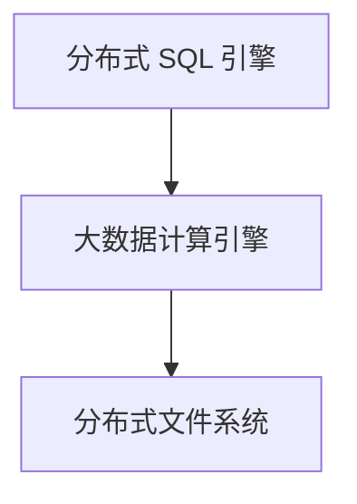

# 数据仓库理论

## 数据仓库的定义

数据仓库是一个**面向主题的**、**集成的**、**相对稳定的**、**反映历史变化的**数据集合，用于提供数据支持和辅助决策。

| 定义         | 解释                                          |
| :----------- | :-------------------------------------------- |
| 面向主题     | 按主题组织数据，每个主题反映业务需求/分析对象 |
| 集成         | 多个数据源汇集                                |
| 相对稳定     | 大量查询为主，修改、删除较少                  |
| 反映历史变化 | 保存大量历史数据                              |

---

## 为什么要建设数仓

!!! note

    数据仓库试图提供一种从操作系统到决策支持环境的**数据流模型**。数据仓库概念的提出是为了解决和数据流相关的各种问题，特别是**多重数据复制带来的高成本问题**。在没有数据仓库的时代，数据分析人员需要收集、清洗、整合多个数据源的数据，并对每个决策支持环境做部分数据复制，耗时长且准确率低。

- 维护历史数据，减轻业务系统存储、计算压力，提供长期数据视图
- 集成多个数据源，提供一个统一的数据视图
- 通过冗余减少表关联，复用计算结果
- 通过建设宽表/集市，提升数据的易用性和可理解性

---

## 数据库 VS 数据仓库

数据库：OLTP，面向业务处理和事务设计，一般会采用范式建模，主要追求低冗余、数据一致性和写入性能。

数据仓库：OLAP，面向主题分析设计的，一般会采用维度建模，主要追求数据的可理解性、查询性能，本质是一种空间换时间的架构。

|          | 数据库                 | 数据仓库                 |
| :------- | :--------------------- | :----------------------- |
| 面向     | 事务                   | 分析                     |
| 数据类型 | 细节、业务             | 综合、清洗过的数据       |
| 数据特点 | 当前的、最新的         | 历史的、跨时间维护       |
| 目的     | 业务处理、事务         | 长期信息需求、决策支持   |
| 设计模型 | 基于 ER 模型，面向应用 | 星型、雪花模型，面向主题 |
| 操作     | 读、写                 | 大多为读                 |
| 数据规模 | 小、中                 | 大                       |

---

## MPP VS 分布式架构

### MPP

传统的数据仓库通过 MPP 来实现。MPP 是一种分布式计算架构，它将单个查询分解为多个并行的任务，每个任务在不同的节点上执行，最后将结果合并返回给用户。MPP 由多个单节点的单机数据库组成，每个节点都有自己的 CPU、内存、存储和操作系统，节点之间通过网络连接。分库分表、汇总查询结果等通过中间件来实现。

- 节点间为非共享架构（Share Nothing），每个节点都有自己的磁盘存储系统和内存系统
- 节点间通过专用高速网络连接
- 设计上优先考虑 C（一致性），其次考虑 A（可用性），尽量做好 P（分区容错性）

**优点：**

- 运算方式精细，延迟低、吞吐低
- 适合中等规模的结构化数据处理

**问题：**

- 单个节点容易成为性能瓶颈，扩展性有限
- 数据热点问题
- 分布式事务的实现会导致扩展性降低

---

### 分布式架构

- 利用分布式文件系统的扩展性，完成海量数据的存储
- 将 SQL 转换为大数据计算引擎任务，完成数据分析
- 设计上优先考虑 P（分区容错性），然后是 A（可用性），最后考虑 C（一致性）
- 与 MPP 最大的不同是，分布式架构是共享数据的，而 MPP 是非共享数据的

**问题：**

- SQL 支持率
- 事务支持（分布式事务）

---

**MPP + 分布式架构：**

- 数据存储采用分布式架构中的公共存储，提高分区容错性
- 上层架构采用 MPP，减少运算延迟（常用于实时流处理）

---

## Lambda VS Kappa 架构

|          | Lambda 架构                              | Kappa 架构                                           |
| :------- | :--------------------------------------- | :--------------------------------------------------- |
| 实时性   | 秒级实时                                 | 秒级实时                                             |
| 计算资源 | 流批分开执行，资源消耗大                 | 只有流计算，正常运行资源消耗少，只有重算资源消耗较大 |
| 重算能力 | 批式全量处理，吞吐量高                   | 流式全量处理，吞吐较批处理低                         |
| 开发测试 | 每个需求都要开发两套代码，开发测试成本高 | 仅需一套代码，开发测试成本低                         |
| 运维成本 | 维护两套架构，运维成本高                 | 只维护一套系统，运维成本低                           |

---

## 数据库三范式

!!! note "1NF"

    **确保表中的每列是原子、不可再分的。**

假设有以下表：

| employee_id | name  | job_code | job       | state_code | home_state |
| ----------- | ----- | -------- | --------- | ---------- | ---------- |
| E001        | Alice | J01      | Chef      | 26         | Michigan   |
| E001        | Alice | J02      | Waiter    | 26         | Michigan   |
| E002        | Bob   | J02      | Waiter    | 56         | Wyoming    |
| E002        | Bob   | J03      | Bartender | 56         | Wyoming    |
| E003        | Alice | J01      | Chef      | 56         | Wyoming    |

所有条目都是原子的，并且有一个复合主键 `(employee_id, job_code)`，因此表符合第一范式（1NF）。

!!! note "2NF"

    在满足 1NF 的情况下，**不能存在部分依赖。**即非主键字段必须**完全依赖**于主键，而不能依赖于主键的一部分。

但是即使你只知道某人的 `employee_id`，那么你也可以确定他们的 `name`、`home_state` 和 `state_code`。`name`、即 `name`、`home_state` 和 `state_code` 依赖于 `employee_id`（复合主键的一部分）。因此该表不符合第二范式（2NF）。

将上面的表进行拆分：

=== "`employee_roles`"

    | employee_id | job_code |
    |-------------|----------|
    | E001        | J01      |
    | E001        | J02      |
    | E002        | J02      |
    | E002        | J03      |
    | E003        | J01      |

=== "`employees`"

    | employee_id | name  | state_code | home_state |
    |-------------|-------|------------|------------|
    | E001        | Alice | 26         | Michigan   |
    | E002        | Bob   | 56         | Wyoming    |
    | E003        | Alice | 56         | Wyoming    |

=== "`jobs`"

    | job_code | job       |
    |----------|-----------|
    | J01      | Chef      |
    | J02      | Waiter    |
    | J03      | Bartender |

!!! note "3NF"

    在满足 2NF 的情况下，**不能存在传递依赖。** 3NF 是对字段冗余性的约束，要求任何字段不能由其他字段派生出来，它要求字段没有冗余，即不存在传递依赖。

在上面的 `employees` 表中，`home_state` 依赖于 `state_code`。所以，如果知道 `state_code`，那么就可以找到对应的 `home_state` 值。为了满足第三范式，继续拆分 `employees` 表。

=== "`employee_roles`"

    | employee_id | job_code |
    |-------------|----------|
    | E001        | J01      |
    | E001        | J02      |
    | E002        | J02      |
    | E002        | J03      |
    | E003        | J01      |

=== "`employees`"

    | employee_id | name  | state_code |
    |-------------|-------|------------|
    | E001        | Alice | 26         |
    | E002        | Bob   | 56         |
    | E003        | Alice | 56         |

=== "`jobs`"

    | job_code | job       |
    |----------|-----------|
    | J01      | Chef      |
    | J02      | Waiter    |
    | J03      | Bartender |

=== "`states`"

    | state_code | home_state |
    |------------|------------|
    | 26         | Michigan   |
    | 56         | Wyoming    |

---

## 数仓分层的意义

!!! note "一些个人思考"

    数据仓库分层主要是基于使用经验进行的优化操作，对于分层意义的探讨，只要合理就行。Kimball 在《数据仓库工具箱》阐述维度建模时，提到了 「**可理解性**」 与 「**性能**」 这两点，我认为这两点精确且简洁地概括了数据仓库建设和维度建模的理念，所以围绕「**可理解性**」 与 「**性能**」 来论述基本不会有偏差。

1. **清晰数据结构**：每一层都有它的作用域和职责，在设计表时有一套标准，在使用表的时候能更方便地定位和理解。​
2. **方便追踪数据来源**：由于最终的分析数据通常是经过复杂架构汇总的结果，有了标准的分层，我们就可以更快速地定位数据来源。
3. **减少重复开发**：规范数据分层，开发一些通用的中间组件，能减少极大的重复计算，提高程序复用性。​
4. **统一数据口径**：通过数据分层提供统一的数据出口，统一对外输出的数据口径。​
5. **复杂问题简单化**：将一个复杂的任务分解成多个步骤来完成，每一层解决特定的问题。

---

## 数仓分层建设思路

---

## 范式建模 VS 维度建模

范式建模（Normalized Modeling）和维度建模（Dimensional Modeling）是数据仓库设计中两种常用的数据建模方法，它们有以下区别：

**一、数据结构**

^^范式建模^^
: 基于关系型数据库的设计理念，遵循严格的规范化规则。通常将数据分解到多个实体中，以减少数据冗余。例如，在一个订单系统中，客户信息、产品信息和订单信息会分别存储在不同的表中。
: 一般采用第三范式（3NF），即一个表中的非主属性都依赖于主属性，并且不存在传递依赖。这种结构在处理复杂的数据关系时非常有效。

^^维度建模^^
: 以分析需求为导向，将数据按照事实表（Fact Table）和维度表（Dimension Table）进行组织。事实表包含业务度量值（如销售额、数量等），而维度表包含描述这些度量值的属性（如时间、地点、产品等）。
: 常见的模式有星型模式和雪花模式。星型模式中，事实表位于中心，周围连接多个维度表；雪花模式则是在星型模式的基础上，对某些维度表进行进一步的规范化，形成类似雪花的结构。

**二、数据处理**

^^范式建模^^
: 在数据插入和更新时，由于数据分散在多个表中，遵循规范化规则，数据一致性容易维护。例如，当客户信息发生变化时，只需要在客户表中更新相应记录。
: 但在查询时，由于数据分散，往往需要进行多表连接操作，这在处理复杂查询时可能会导致性能下降。例如，查询某个客户的所有订单信息，可能需要连接客户表、订单表和订单详情表。

^^维度建模^^
: 在数据加载时，由于数据是按照分析需求进行组织的，可能会存在一定的数据冗余。例如，在维度表中可能会重复存储一些属性值。
: 但在查询时，由于数据结构简单，通常只需要对事实表和少数维度表进行连接操作，查询性能较高。例如，在分析销售数据时，只需要将销售事实表与相关的时间、地点和产品维度表连接即可。

**三、应用场景**

^^范式建模^^
: 适用于对数据一致性要求较高、业务逻辑复杂的操作型数据库系统。例如，企业的核心业务系统，如 ERP（企业资源计划）系统，需要严格保证数据的准确性和一致性。

^^维度建模^^
: 主要应用于数据仓库和商业智能（BI）系统，这些系统以数据分析和决策支持为主要目的。例如，企业的数据分析部门利用维度建模构建数据仓库，以便快速生成各类报表和进行数据分析。

**四、维护难度**

^^范式建模^^
: 在数据结构变化时，由于数据分散且遵循规范化规则，对表结构的修改相对容易。例如，添加一个新的客户属性，只需要在客户表中添加一个新列。
: 但在处理复杂的业务逻辑和数据关系时，维护成本可能较高，尤其是在涉及多表连接的查询操作时。

^^维度建模^^
: 在数据结构变化时，由于数据存在一定的冗余，可能需要对多个表进行修改。例如，当产品维度增加一个新属性时，可能需要在多个相关的事实表和维度表中进行相应的修改。
: 然而，在数据分析需求相对稳定的情况下，维度建模的数据仓库维护成本相对较低，因为查询操作相对简单。

---

## 需求开发流程

^^I.需求沟通^^

: 沟通需求的背景、排期优先级以及最后交付物

^^II.评估可行性和潜在影响^^

: 需要用到哪些数据，目前有没有对应的模型？没有的话是否需要接入新的数据？接入的话是否会对下游 SLA 产生影响？

^^III.数据开发^^

: 1.数据探查：简单走一遍数据链路，看需要的字段是否都能取到
: 2.选模型（已有）：一般越上层的表，字段越丰富/预计算过，可以减少重复开发/计算，但是同时越上层耦合程度越高，产出时间也越晚
: 3.模型开发（新建）：梳理一下需要新建哪些表，放哪一层，依赖关系是怎样。维度建模流程：业务过程 → 粒度 → 维度 → 事实

^^IV.测试&上线^^

: 关注：

    1. 数据的准确性、数据质量
    2. 代码规范、命名规范
    3. 性能

^^V.DQC&SLA^^

: 按需配置 DQC 和 SLA

---

## 模型设计基本原则

| 原则                   | 阐述                                                                                                         | 目的及意义                                                                                                                       |
| ---------------------- | ------------------------------------------------------------------------------------------------------------ | -------------------------------------------------------------------------------------------------------------------------------- |
| 高内聚和低耦合         | 将业务相关、粒度相同的数据设计为同一个物理模型，将高频率同时访问的数据放一起，将低频率同时访问的数据分开存储 | 提高数据组织合理性，便于快速获取高频访问数据，提升使用效率，降低关联干扰，使数据结构清晰，便于维护管理                           |
| 核心模型与扩展模型分离 | 核心模型包括的字段支持常用的核心业务，扩展模型包括的字段支持个性化或少量应用的需要                           | 聚焦核心业务需求，保障核心业务数据处理高效、稳定，满足多样化业务诉求，保持数据模型灵活性和可扩展性                               |
| 公共处理逻辑下沉       | 越是公用的处理逻辑，越应该在数据调度依赖的底层进行封装与实现，不要让公共逻辑多处同时存在                     | 减少代码重复编写，降低不一致性风险，便于统一修改优化，提高维护效率，保证数据处理一致性和准确性                                   |
| 成本与性能平衡         | 适当的数据冗余可以换取查询和刷新性能，但不要过度冗余                                                         | 提升查询、刷新等操作性能，加快数据读取和展示速度，提高系统响应能力，避免过度冗余占用大量空间及增加操作复杂度，权衡成本与性能关系 |
| 数据可回滚             | 处理逻辑不变，在不同时间多次运行，数据结果确定不变                                                           | 保证数据稳定性和可追溯性，便于还原历史数据状态，助力数据质量把控和问题排查                                                       |
| 一致性                 | 具有相同含义的字段在不同的表中命名必须相同                                                                   | 保证数据在不同表间统一性、规范性，便于理解数据含义，避免误解，方便数据整合、关联及分析，提升可用性                               |
| 命名清晰可理解         | 表名需易于消费者理解和使用                                                                                   | 让使用者快速知晓表中数据范围和用途，提高查找、使用效率，有助于数据模型推广和应用                                                 |

---

## 维度建模有哪些模型

| 模型名称 | 定义                                                                                                                                                      | 特点及应用场景                                                                                                                                         |
| -------- | --------------------------------------------------------------------------------------------------------------------------------------------------------- | ------------------------------------------------------------------------------------------------------------------------------------------------------ |
| 星型模型 | 以事实表作为中心，所有的维度表都直接与事实表相连接，整体结构呈现出类似星星的形状，故而得名星型模型。是维度建模中最为常用的一种方式。                      | 结构简单清晰，数据关系直观，数据分析和查询时操作相对便捷，能高效获取数据。常用于业务逻辑相对清晰、维度相对固定的数据分析场景。                         |
| 雪花模型 | 由星型模型衍生而来，维度表可以进一步连接其他维度表，结构特点在一定程度上类似于遵循第三范式（3NF）的关系模型，通过对维度表的进一步细化和规范化来组织数据。 | 减少了数据冗余，数据结构更规范化，但查询时相较于星型模型可能需更多连接操作，复杂度增加。适用于对数据规范性要求较高、数据量较大且需严格控制冗余的场景。 |
| 星座模型 | 是星型模型的衍生形式，基于多张事实表构建，且事实表之间会共享维度信息，即维度表之间有可能相互连接在一起，在实际企业环境中多被用于维度建模。                | 能适应企业复杂业务场景，将多个相关业务的事实表通过共享维度进行整合，便于从多个角度对不同业务数据进行综合分析。                                         |

---

## 事实表设计

### 事实类型

作为度量业务过程的事实，有可加性、半可加性和不可加性三种类型：

- 可加性事实指可以按照与事实表关联的任意维度进行汇总。
- 半可加事实只能按照特定维度汇总，不能对所有维度汇总。
- 不可加性事实完全不具备可加性，比如比例事实。对于不可加性事实可考虑分解为可加的组件来实现聚合。

---

### 事实表类型

- **事务事实表**：记录事务层面的事实，记录最原子的数据，粒度通常为每个事务记录一条数据
- **周期快照事实表**：以周期性的时间间隔来记录事实，如库存日快照表，粒度是一个周期性的时间间隔内的事务记录一条数据
- **累计快照事实表**：记录不确定周期的数据，通常覆盖一个事务的生命周期，记录一些关键时间点，如订单累计快照事实表会记录付款日期、发货日期、收货日期等。

|                | 事务事实表             | 周期快照事实表                   | 累计快照事实表                       |
| -------------- | ---------------------- | -------------------------------- | ------------------------------------ |
| **时间**       | 离散事务时间点         | 以有规律的、可预测的间隔产生快照 | 用于时间跨度不确定的不断变化的工作流 |
| **日期维度**   | 事务日期               | 快照日期                         | 相关业务过程涉及的多个日期           |
| **粒度**       | 每行代表实体的一个事务 | 每行代表某时间周期的一个实体     | 每行代表一个实体的生命周期           |
| **事实**       | 事务事实               | 累积事实                         | 相关业务过程事实和时间间隔事实       |
| **事实表加载** | 插入                   | 插入                             | 插入与更新                           |
| **事实表更新** | 不更新                 | 不更新                           | 业务过程变更时更新                   |

---

### 事实表设计过程

**第一步：选择业务过程及确定事实表类型**

- **选业务过程**：业务过程用行为动词体现活动，如淘宝订单流转含“创建订单”“买家付款”等四个过程，需依业务需求选与维度建模相关的过程。
- **定事实表类型**：选好业务过程后确定事实表类型。如果选“买家付款”这一业务过程则对应单事务事实表；如果选四个过程且要分析时间间隔，则对应累计快照事实表。

**第二步：声明粒度**

- **重要性**：明确粒度可避免对事实表行含义理解混淆，保证按统一细节层次记录事实。
- **原则**：尽量选最细的原子粒度，保障事实表应用灵活性。

**第三步：确定维度**

完成粒度声明即确定主键，据此确定维度组合与相关字段，要选能描述业务环境的维度信息，如淘宝订单付款事实表（粒度为子订单）的买家、卖家等维度。

**第四步：确定事实**

通过回答“过程的度量是什么”确定事实，如淘宝订单付款事实表中同粒度事实有子订单分摊支付金额、邮费、优惠金额等。

**第五步：冗余维度**

传统维度建模星型模型将维度放维表，用外键获取以减少冗余、存储消耗；大数据事实表模型为提高下游用户使用效率，常冗余常用维度，如淘宝订单付款事实表中冗余商品类目、卖家店铺等字段。

---

### 多事务事实表中事实的处理方法

**方法一：使用不同事实字段存放不同业务过程的事实**
: 不同业务过程的事实通过设置不同的事实字段来进行存放。
例如，在淘宝交易事务事实表中，会设置“下单度量”字段用于存放下单业务过程相关事实，“支付度量”字段用于存放支付业务过程相关事实，“完结度量”字段用于存放完结业务过程相关事实。

**方法二：使用同一个事实字段存放不同业务过程的事实并增加业务过程标签**
: 将不同业务过程的事实放在同一个事实字段中存储，同时增加一个业务过程标签来区分。
比如在收藏事务事实表中，会设置“收藏删除类型”字段以表明业务过程类型（是收藏还是删除等），以及“收藏删除度量”字段来存放对应的度量数据。

**两种方法的选择依据**

- 当不同业务过程的度量比较相似时，适宜采用第二种方式。
- 当不同业务过程的度量差异比较大时，则采用第一种方式。

---

### 事实表设计的八大原则

1. 尽可能包含所有与业务过程相关的事实
2. 只选择与业务过程相关的事实
3. 分解不可加事实为可加事实
4. 在选择维度和事实之前必须先声明粒度
5. 在同一个事实表中不能有不同粒度的事实
6. 事实的单位要保持一致
7. 对事实的 null 值要处理
8. 使用退化维度提高事实表的易用性

---

## 维度表设计

### 维度表设计过程

以淘宝的商品维度为例阐述维度设计方法

**第一步：选择维度**
: 维度建模中，维度的选择至关重要，其作为核心部分，在企业级数仓里务必确保维度的唯一性。在此案例中，确定选择的维度为商品维度，它将成为后续围绕商品相关数据进行分析的关键角度。

**第二步：确定主维表**
: 通常而言，主维表一般选取 ODS（操作数据存储）表，这类表能够直接与业务系统进行同步，保障数据的及时性与原始性。以淘宝商品维度为例，“s_auction_auctions”表是与前台商品中心系统实现同步的商品表，所以该表即被确定为主维表，它承载着商品维度的核心数据信息，是后续构建维度的重要基础。

**第三步：确定相关维表**
: 数据仓库本身是对业务源系统数据的整合汇聚，在实际业务中，不同业务系统或者同一业务系统内的不同表之间往往存在着关联性。基于对业务流程的梳理，要精准确定哪些表与主维表存在关联关系。就淘宝商品维度而言，经过梳理分析可以发现，其与类目、SPU（标准化产品单元）、卖家、店铺等维度存在关联，也就意味着与这些维度对应的相关表会和主维表在构建商品维度时有数据上的关联互动。

**第四步：确定维度属性**

这一步骤包含两个子步骤：

1. **从主维表中选择或生成维度属性**：首先聚焦主维表，也就是“s_auction_auctions”表，从中挑选那些能够清晰描述商品维度的属性，例如商品名称、商品编号、商品价格等基础属性，同时，也可以根据业务需求以及已有的数据，通过一定的计算、转换等方式生成新的维度属性，用以更全面、细致地刻画商品特征。
2. **从相关维表中选择或生成维度属性**：接着，针对那些与主维表相关联的表，如类目表、SPU 表、卖家表、店铺表等，同样从这些表中选取对商品维度有价值的属性，像商品所属类目名称、SPU 规格、卖家信誉等级、店铺地址等，还可以依据业务逻辑与数据分析要求，从中生成一些新的维度属性，进一步丰富商品维度的描述信息，使其更利于后续从多维度角度对商品相关数据进行分析与洞察。

---

### 处理缓慢变化维

**1. 重写维度值**

- **特点**：采用这种方式时，一旦维度值发生变化，就直接进行重写覆盖，其弊端在于无法保留历史数据，导致过往的维度状态信息丢失，不利于追溯历史情况。

**2. 快照维表**

- **方式描述**：每天保存一份全量快照数据。
- **优点**：简单有效，其开发和维护成本相对较低，在实际操作中较为容易实施。使用方便且理解性好，对于数据使用方而言，只需要限定日期，就能获取到当天的快照数据。而且，任意一天的事实快照和维度快照通过维度的自然键进行关联即可，操作流程清晰明了。
- **缺点**：存在存储资源浪费的问题。比如针对某一维度，如果每天的变化量占总体数据量的比例很低，甚至没有变化，那么全量保存快照数据就会极大地浪费存储空间，增加不必要的数据存储成本。

**3. 插入新的维度行**

- **特点**：当维度发生变化后，通过插入新的维度行来记录新的维度值，以此能够保留历史数据。
- **局限性**：然而，该方式存在一定局限，它不能将变化前后记录的事实归一化为变化前的维度或者变化后的维度。例如，根据具体业务需求，若需要将 11 月份的交易额全部统计到类目 2 上，利用这种方式是无法实现相应操作的，会给按照特定维度统一统计事实数据带来不便。

**4. 添加维度列**

- **特点**：此方式在维度表中添加新的维度列来记录维度变化情况，优势在于可以保留历史数据，方便后续查看维度在不同阶段的具体状态，有助于进行历史数据的分析与比对。

**5. 拉链表**

- **方式描述**：通过新增两个时间戳字段（start_dt 和 end_dt），将所有以天为粒度的变更数据记录下来。
- **背景示例**：例如在 2016 年 1 月 1 日，卖家 A 在淘宝网发布了 B、C 两个商品，到了 1 月 2 日，卖家 A 在淘宝网下架了商品 B，同时又发布了商品 D，像这样的数据变化情况可以通过拉链表进行记录。
- **与快照维表对比**：在快照维表中，dt 是分区字段，而拉链表对于不变的数据，不再重复存储，在一定程度上节省了存储空间。
- **使用示例**：例如，当用户想要访问 1 月 2 日的数据时，只需要限制 start_dt <= 20160102 和 end_dt > 20160102 即可获取到相应数据。
- **缺点**：一方面，其理解性较差，相较于其他方式，使用者需要花费更多精力去理解其存储逻辑和数据关联方式；另一方面，其存储方式采用 start_dt 和 end_dt 做分区，随着时间的推移，分区数量会极度膨胀，而现行的数据库系统对分区数量通常都有所限制，这可能会在长期使用过程中带来一些不便和问题。

---

## 数据质量

1. **完整性**：数据的字段和条数是否完整，是否存在缺失的情况
2. **准确性**：是指数据中记录的信息和数据是否准确，是否存在异常或者错误的信息，如负数金额
3. **一致性**：对于同一份数据，必须保证一致性（命名一致性、口径一致性）
4. **时效性**：保障数据能够及时产出

| 目标           | 达成方式      | 具体说明                                                                                                                                                                                             |
| -------------- | ------------- | ---------------------------------------------------------------------------------------------------------------------------------------------------------------------------------------------------- |
| 完整性和准确性 | 配置 DQC 监控 | 通过配置数据质量监控（DQC），对相关数据进行监测，以此确保数据具备完整性与准确性，及时发现可能存在的数据问题并加以解决。                                                                              |
| 时效性         | 配置 SLA 基线 | 借助配置服务水平协议（SLA）基线的方式，来保障数据的时效性，使得数据能够在规定时间内满足相应的业务需求，符合预期的时间要求。                                                                          |
| 一致性         | 权限管控      | 采取权限管控的思路，不对外开放操作数据存储（ODS）到明细数据层（DWD）的权限，而是将指标放置在主题宽表中，并保证相同粒度的表只有一张，以此来满足一致性这一规范性要求，确保数据在相应环节的一致性表现。 |
| 一致性         | 指标管理系统  | 运用指标管理系统来保障数据的一致性，从系统层面规范和管理相关指标，使其符合一致性的要求，实现数据在各方面的规范统一。                                                                                 |

1. 事前预防：所有可能对数据链路产生影响的改动都需要进行评估。上线前的探查、测试、代码评审等。
2. 事中监控：DQC 强规则 → 熔断；弱规则 → 短信/电话/APP 告警
3. 事后补救：排查故障，补数，解决代码问题

---

## 如何理解大数据 & 数仓

更好、更有效地组织数据，提升数据价值。

| 流程                | 意义、价值                                                                       |
| ------------------- | -------------------------------------------------------------------------------- |
| 数据的采集          | 采集是基础，获取全面准确的原始数据。                                             |
| 数据建模 / 数仓建设 | 结构化组织数据，设计合理模型，提升数据质量与查询效率。**纵向分层、横向分主题**。 |
| 数据链路的建设      | 构建完整流程，确保数据顺畅流动。提高时效性与可靠性。                             |
| 数据应用的开发      | 利用数据开发应用（接口/报表/BI），转化为信息洞察，实现商业价值。                 |
| 数仓维护、数据治理  | 维护数仓保证稳定运行与数据质量，包括 DQC、SLA 等，降低风险提升价值。             |

---

## 数仓工作理解 & 数仓价值

个人认为数仓更多的是企业数据方面的基建，不同发展阶段的作用/价值不同。

^^前期：^^

: 存储历史数据，建设简单的数据链路，来支持简单的需求。

^^中期：^^

: 数仓建设方面通过合理的分层、分主题以及合理的数据建模，来追求数据的**可理解性和性能**。数据治理方面追求**数据质量和时效性**。这两方面共同决定了下游/其他部门取数、用数的难易程度，以及是否信任数仓产出的数据。

^^后期：^^

: 从业务沉淀数据 → 数据反哺业务。主动思考数据能产出的价值，寻求一些跨部门合作的机会。

---

## 什么是一个好数仓

**I. 合理的分层、分主题（MECE）**

**II. 规范的模型设计**

- 高内聚低耦合（主题）
- 核心/扩展分离（稳定性）
- 公共处理下沉（复用性）
- 命名规范（规范）

**III. 良好的中间层设计**

- 避免重复开发
- 提升指标一致性
- 宽表提供一个统一视图

**IV. 良好的数据质量**

- 完整性
- 准确性
- 时效性
- 一致性

---

## 如何衡量数仓模型为业务带来的价值

**I. 具体业务场景的直接价值**

: e.g.风险商品识别+下架了多少，有具体量化的数字

**II. 间接对核心指标的贡献**

: 不好直接衡量，但会间接作用于核心指标上。e.g.看板类需求用于支持决策，决策的影响最终会体现在指标上，此时需要对指标进行**归因分析**

**III. 数据作为基建的价值**

: 数据质量、时效性、性能、开发效率等

---

## 如何评价一个数仓模型的好坏

**I. 数据质量**

: 准确性、完整性、一致性、时效性

**II. 数据建模**

- 高内聚低耦合（主题）
- 核心/扩展分离（稳定性）
- 公共处理下沉（复用性）
- 命名规范（规范）

**III. 可理解性/易用性**

: 性能和可理解性的权衡取舍

**IV. 成本 VS 收益**

: 计算/存储的成本 VS 实际的收益
